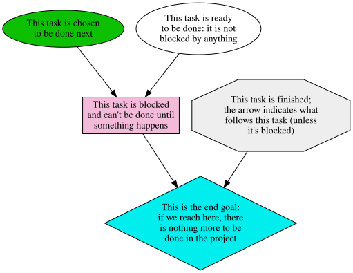

# Produce graphical road maps for projects

Produce directed acyclic graph representations of a project roadmap.
The idea is to show the steps needed to reach a goal, and the order
they need to be taken, but ignore due dates and other irrelevant
details.

# Example

~~~yaml
goal:
  label: |
    This is the end goal:
    if we reach here, there
    is nothing more to be
    done in the project
  depends:
  - finished
  - blocked

finished:
  status: finished
  label: |
    This task is finished;
    the arrow indicates what
    follows this task (unless
    it's blocked)

ready:
  status: ready
  label: |
    This task is ready 
    to be done: it is not
    blocked by anything

next:
  status: next
  label: |
    This task is chosen 
    to be done next

blocked:
  status: blocked
  label: |
    This task is blocked
    and can't be done until
    something happens
  depends:
  - ready
  - next
~~~

To run:

~~~sh
cargo run --bin roadmap2dot legend.yaml | dot -Tsvg > legend.svg
~~~

This will produce a graph, which is visible below if this README is
rendered from the source tree; or you can it [in the
repository](https://gitlab.com/larswirzenius/roadmap/-/blob/main/legend.svg).

# Legalese

Copyright 2019  Lars Wirzenius

Permission is hereby granted, free of charge, to any person obtaining a copy of this
software and associated documentation files (the "Software"), to deal in the Software
without restriction, including without limitation the rights to use, copy, modify,
merge, publish, distribute, sublicense, and/or sell copies of the Software, and to
permit persons to whom the Software is furnished to do so.

THE SOFTWARE IS PROVIDED "AS IS", WITHOUT WARRANTY OF ANY KIND, EXPRESS OR IMPLIED,
INCLUDING BUT NOT LIMITED TO THE WARRANTIES OF MERCHANTABILITY, FITNESS FOR A
PARTICULAR PURPOSE AND NONINFRINGEMENT. IN NO EVENT SHALL THE AUTHORS OR COPYRIGHT
HOLDERS BE LIABLE FOR ANY CLAIM, DAMAGES OR OTHER LIABILITY, WHETHER IN AN ACTION
OF CONTRACT, TORT OR OTHERWISE, ARISING FROM, OUT OF OR IN CONNECTION WITH THE
SOFTWARE OR THE USE OR OTHER DEALINGS IN THE SOFTWARE.
