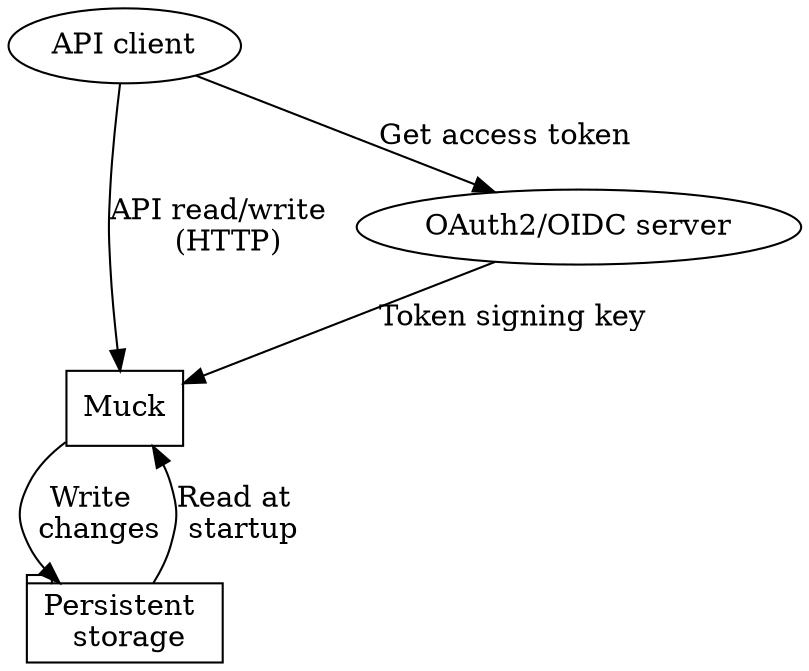

Introduction
=============================================================================

Muck is intended for storing relatively small pieces of data securely,
and accessing them quickly. Intended uses cases are:

* storing user, client, application, and related data for an OpenID
  Connect authentication server
* storing personally identifiable information of data subjects (in the
  GDPR sense) in a way that they can access and update, assuming
  integration with a suitable authentication and authorization server
* in general, storage for web applications of data that isn't large
  and fits easily into RAM

Muck is a JSON store, with an access controlled RESTful HTTP API. Data
stored in Muck is persistent, but kept in memory for fast access. Data
is represented as JSON objects.

Access is granted based on signed JWT bearer tokens. An OpenID Connect
or OAuth2 identity provider is expected to give such tokens to Muck
clients. The tokens must be signed with a public key that Muck is
configured to accept.

Access control is simplistic. Each resource is assigned an owner
upon creation, and each user can access (see, update, delete) only
their own resources. A use with "super" powers can access, update, and
delete resources they don't own, but can't create resources for others.
This will be improved later.

Architecture
-----------------------------------------------------------------------------

Muck stores data persistently in its local file system. It provides an
HTTP API for clients. Muck itself does not communicate otherwise with
external entities.

Authentication
-----------------------------------------------------------------------------

[OAuth2]: https://oauth.net/
[OpenID Connect]: https://openid.net/connect/
[JWT]: https://en.wikipedia.org/wiki/JSON_Web_Token

Muck uses [OAuth2][] or [OpenID Connect][] bearer tokens as access
tokens. The tokens are granted by some form of authentication service,
are [JWT][] tokens, and signed using public-key cryptography. The
authentication service is outside the scope of this document; any
standard implementation should work.

Muck will be configured with one public key for validating the tokens.
For Muck to access a token:

* its signature must be valid according to the public key
* it must be used while it's valid (after the validity starts, but
  before if expires)
* its audience must be the specific Muck instance
* its scope claim contains the specified scopes needed for the
  attempted operation
* it specified an end-user (data subject)

Every request to the Muck API must include a token, in the
`Authorization` header as a bearer token. The request is denied if the
token does not pass all the above checks.

Requirements
=============================================================================

This chapter lists high level requirements for Muck.

Each requirement here is given a unique mnemonic id for easier
reference in discussions.

**SimpleOps** --- Muck must be simple to install and operate.
    Installation should be installing a .deb package, configuration by
    setting the public key for token signing of the authentication
    server.

**Fast** --- Muck must be fast. The speed requirement is that Muck
    must be able to handle at least 100 concurrent clients, creating
    1000 objects each, and then retrieving each object, and then
    deleting each object, and all of this must happen in no more than
    ten minutes (600 seconds). Muck and the clients should run on
    different virtual machines.

**Secure** --- Muck must allow access only by an authenticated client
    representing a data subject, and must only allow that client to
    access objects owned by the data subject, unless the client has
    super privileges. The data subject specifies, via the access
    token, what operations the client is allowed to do: whether they
    may read, update, or delete objects.

HTTP API
=============================================================================

The Muck HTTP API has one endpoint &ndash; `/res` &ndash; that's used
for all objects. The objects are called resources by Muck.

The JSON objects Muck operates on must be valid, but their structure
does not matter to Muck.

Metadata
-----------------------------------------------------------------------------

Each JSON object stored in Muck is associated with metadata, which is
represented as the following HTTP headers:

* **Muck-Id** &ndash; the resource id
* **Muck-Revision** &ndash; the resource revision

The id is assiged by Muck at object creation time. The revision is
assigned by Muck when the object is created or modified.

API requests
-----------------------------------------------------------------------------

The RESTful API requests are POST, PUT, GET, and DELETE.

* **POST /res** &ndash; create a new object
* **PUT /res** &ndash; update an existing object
* **GET /res** &ndash; retrieve a existing object
* **DELETE /res** &ndash; delete an existing object

Although it is usual for RESTful HTTP APIs to encode resource
identifiers in the URL, Muck uses headers (Muck-Id, Muck-Revision) for
consistency, and to provide for later expansion. Muck is not intended
to be used manually, but by programmatic clients.

Additionally, the "sub" claim in the token is used to assign and check
ownership of the object. If the scope contains "super", the sub claim
is ignored, except for creation.

The examples in this chapter use HTTP/1.1, but should provide the
necessary information for other versions of HTTP. Also, only the
headers relevant to Muck are shown. For example, HTTP/1.1 requires
also a Host header, but this is not shown in the examples.

### Creating an object: POST /res

Creating requires:

* "create" in the scope claim
* a non-empty "sub" claim, which will be stored by Muck as the owner
  of the created object

The creation request looks like this:

~~~{.numberLines}
POST /res HTTP/1.1
Content-Type: application/
Authorization: Bearer TOKEN

{"foo": "bar"}
~~~

Note that the creation request does not include Muck-Id or
Muck-Revision headers.

A successful response looks like this:

~~~{.numberLines}
201 Created
Content-Type: application/json
Muck-Id: ID
Muck-Revision: REV1
~~~

Note that the response does not contain a copy of the resource.

### Updating an object: PUT /res

Updating requires:

* "update" in the scope claim
* one of the following:
  - "super" in the scope claim
  - "sub" claim matches owner of object Muck; super user can update
    any resource, but otherwise data subjects can only update their own
    objects
* Muck-Revision matches the current revision in Muck; this functions
  as a simplistic guard against conflicting updates from different
  clients.

The update request looks like this:

~~~{.numberLines}
PUT /res HTTP/1.1
Authorization: Bearer TOKEN
Content-Type: application/json
Muck-Id: ID
Muck-Revision: REV1

{"foo": "yo"}
~~~

In the request, ID identifies the object, and REV1 is its revision.

The successful response:

~~~{.numberLines}
200 OK
Content-Type: application/json
Muck-Id: ID
Muck-Revision: REV2
~~~

Note that the update response also doesn't contain the object. The
client should remember the new revision, or retrieve the object get
the latest revision before the next update.

### Retrieving an object: GET /res

A request requires:

* "show" in the scope claim
* one of the following:
  - "super" in the scope claim
  - "sub" claim matches owner of object Muck; super user can retrieve
    any resource, but otherwise data subjects can only update their own
    objects

The request to retrieve a response:

~~~{.numberLines}
GET /res HTTP/1.1
Authorization: Bearer TOKEN
Muck-Id: ID
~~~

A successful response:

~~~{.numberLines}
200 OK
Content-Type: application/json
Muck-Id: ID
Muck-Revision: REV2

{"foo": "yo"}
~~~

Note that the response does NOT indicate the owner of the resource.

Acceptance criteria for Muck
=============================================================================

This chapter details the acceptance criteria for Muck, and how they're
verified.

Basic object handling
-----------------------------------------------------------------------------

First, we need a new Muck server. It will initially have no objects.
We also need a test user, whom we'll call Tomjon.

~~~scenario
given a fresh Muck server
given I am Tomjon
~~~

Tomjon can create an object.

~~~scenario
when I do POST /res with {"foo": "bar"}
then response code is 201
then header Muck-Id is ID
then header Muck-Revision is REV1
~~~

Tomjon can then retrieve the object. It has the same revision and
body.

~~~scenario
when I do GET /res with Muck-Id: {ID}
then response code is 200
then header Muck-Revision matches {REV1}
then body matches {"foo": "bar"}
~~~

Tomjon can update the object, and the update has the same id, but a
new revision and body.

~~~scenario
when I do PUT /res with Muck-Id: {ID}, Muck-Revision: {REV1}, and body {"foo":"yo"}
then response code is 200
then header Muck-Revision is {REV2}
then revisions {REV1} and {REV2} are different
~~~

If Tomjon tries to update with the old revision, it fails.

~~~scenario
when I do PUT /res with Muck-Id: {ID}, Muck-Revision: {REV1}, and body {"foo":"yo"}
then response code is 409
~~~

After the failed update, the object or its revision haven't changed.

~~~scenario
when I do GET /res with Muck-Id: {ID}
then response code is 200
then header Muck-Revision matches {REV2}
then body matches {"foo": "yo"}
~~~

We can delete the resource, and then it's gone.

~~~scenario
when I do DELETE /res with Muck-Id: {ID}
then response code is 200
when I do GET /res with Muck-Id: {ID}
then response code is 404
~~~

Restarting Muck
-----------------------------------------------------------------------------

Muck should store data persistently. For this we need our test user to
have the "super" capability.

~~~scenario
given a fresh Muck server
given I am Tomjon, with super capability
when I do POST /res with {"foo": "bar"}
then header Muck-Id is ID
then header Muck-Revision is REV1
~~~

So far, so good. Nothing new here. Now we restart Muck. The resource
just created must still be there.

~~~scenario
when I restart Muck
when I do GET /res with Muck-Id: {ID}
then response code is 200
then header Muck-Revision matches {REV1}
then body matches {"foo": "bar"}
~~~

Super user access
-----------------------------------------------------------------------------

Check here that if we have super scope, we can retrieve, update, and
delete someone else's resources, but if we create a resourec, it's
ours.

Invalid requests
-----------------------------------------------------------------------------

There are a number of ways in which a request might be rejected. This
section verifies all of them.

### Accessing someone else's data

~~~scenario
given a fresh Muck server
given I am Tomjon
when I do POST /res with {"foo": "bar"}
then header Muck-Id is ID
then header Muck-Revision is REV1
when I do GET /res with Muck-Id: {ID}
then response code is 200
then header Muck-Revision matches {REV1}
then body matches {"foo": "bar"}
~~~

After this, we morph into another test user.

~~~scenario
given I am Verence
when I do GET /res with Muck-Id: {ID}
then response code is 404
~~~

Note that we get a "not found" error and not a "access denied" error
so that Verence doesn't know if the resource exists or not.

### Updating someone else's data

This is similar to retrieving it, but we try to update instead.

~~~scenario
given a fresh Muck server
given I am Tomjon
when I do POST /res with {"foo": "bar"}
then header Muck-Id is ID
then header Muck-Revision is REV1
given I am Verence
when I do PUT /res with Muck-Id: {ID}, Muck-Revision: {REV1}, and body {"foo":"yo"}
then response code is 404
~~~

### Deleting someone else's data

This is similar to retrieving it, but we try to delete it instead.

~~~scenario
given a fresh Muck server
given I am Tomjon
when I do POST /res with {"foo": "bar"}
then header Muck-Id is ID
then header Muck-Revision is REV1
given I am Verence
when I do DELETE /res with Muck-Id: {ID}
then response code is 404
~~~

### Bad signature

### Not valid yet

### Not valid anymore

### Not for our instance

### Lack scope for creation

### Lack scope for retrieval

### Lack scope for updating

### Lack scope for deletion

### No subject when creating

### No subject when retrieving

### No subject when updating

### No subject when deleting

### Invalid JSON when creating

### Invalid JSON when updating

# Possible future changes

* There is no way to list all the resources a user has, or search for
  resource. This should be doable in some way. With a search, a
  listing operation is not strictly necessary.

* It's going to be inconvenient to only be able to access one's own
  resources. It would be good to support groups. A resource could be
  owned by a group, and end-users / subjects could belong to any
  number of groups. Also, groups should be able to belong to groups.
  Each resource should be able to specify for each group what access
  members of that group should have (retrieve, update, delete). There
  should be no limits to how many group access control rules there are
  per resource.

  This would allow setups such as each resource representing a stored
  file, and some groups would be granted read access, or read-write
  access, or read-delete access to the files.

* Also, it might be good to be able to grant other groups access to
  controll a resource's access control rules.

* It might be good support schemas for resources?

* It might be good to have a configurable maximum size of a resource.
  Possibly per-user quotas.

* It would be good to support replication, sharding, and fault
  tolerance.

* Monitoring, logging, other ops requirements?

* Encryption of resources, so that Muck doesn't see the contents?

* Should Muck sign the resources it returns, with its own key?
