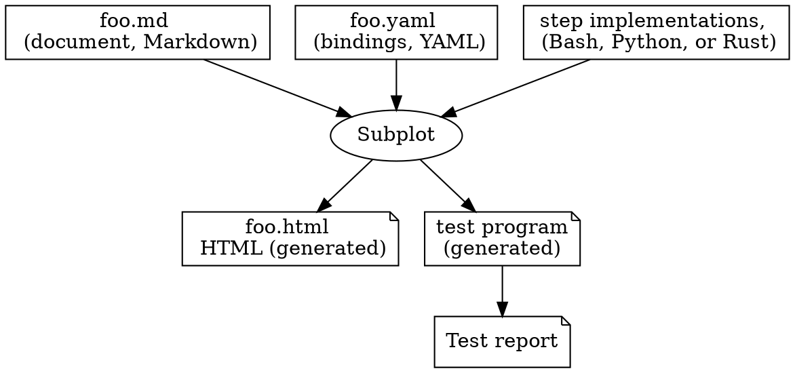
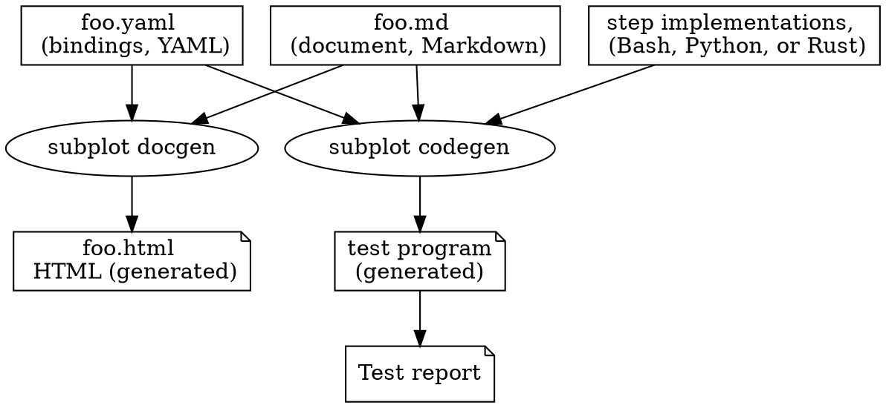

# Introduction

Subplot is software to help capture and communicate acceptance
criteria for software and systems, and how they are verified, in a way
that's understood by all project stakeholders. The current document
contains the acceptance criteria for Subplot itself, and its
architecture.

The acceptance criteria are expressed as _scenarios_, which roughly
correspond to use cases. The scenario as accompanied by explanatory
text to explain things to the reader. Scenarios use a given/when/then
sequence of steps, where each step is implemented by code provided by
the developers of the system under test. This is very similar to the
[Cucumber][] tool, but with more emphasis on producing a standalone
document.

[Cucumber]: https://en.wikipedia.org/wiki/Cucumber_(software)

## Acceptance criteria and acceptance tests

We define the various concepts relevant to Subplot as follows:

* **Acceptance criteria:** What the stakeholders require of the system
  for them to be happy with it and use it.

* **Stakeholder:** Someone with a keen interest in the success of a
  system. They might be a paying client, someone who uses the system,
  or someone involved in developing the system. Depending on the
  system and project, some stakeholders may have a bigger say than
  others.

* **Acceptance test:** How stakeholders verify that the system
  fulfills the acceptance criteria, in an automated way. Some criteria
  may not be possible to verify automatically.

* **Scenario:** In Subplot, the acceptance criteria are written as
  freeform prose, with diagrams, etc. The scenarios, which are
  embedded blocks of Subplot scenario language, capture the mechanisms
  of verifying that criteria are met - the acceptance tests - showing
  step by step how to determine that the software system is acceptable
  to the stakeholders.

## A basic workflow for using Subplot

We recommend the following initial approach to using Subplot, which
you can vary based on your particular needs and circumstances.

1. Start with a small acceptance document that you think expresses
   some useful requirements.
2. Write some acceptance criteria and have them agreed among the
   stakeholders.
3. Write scenarios to verify that the criteria are met, and have those
   scenarios agreed by the stakeholders.
4. Write bindings and test functions, so that as the code is written
   it can be tested against the acceptance criteria.
5. Iterate on this in short cycles to maximise discussion and
   stakeholder buy-in.

You definitely want to keep the subplot document source code in
version control. You certainly need to have people who can write
technical text that's aimed at all your stakeholders.

## Subplot architecture

Subplot reads an input document, in Markdown, and generates a typeset
output document, as HTML, for all stakeholders to understand.
Subplot also generates a test program, in Python, that verifies the
acceptance criteria are met, for developers and testers and auditors
to verify the system under test meets its acceptance criteria. The
generated program uses code written by the Subplot user to implement
the verification steps. The diagram below illustrates this and shows how
data flows through the system.



Subplot generated HTML itself.

Subplot actually consists mainly of two separate programs:
**subplot docgen** for generating output documents, and **subplot codegen** for
generating the test program. There are a couple of additional tools
(**subplot metadata** for reporting meta data about a Subplot document, and
**subplot extract** for extracting embedded files from a subplot document.

Thus a more detailed architecture view is shown below.



## A fairy tale of acceptance testing

The king was upset. This naturally meant the whole court was in a
tizzy and chattering excitedly at each other, while trying to avoid
the royal wrath.

"Who will rid me of this troublesome chore?" shouted the king, and
quaffed a flagon of wine. "And no killing of priests, this time!"

The grand hall's doors were thrown open. The grand wizard stood in the
doorway, robe, hat, and staff everything, but quite still. After the
court became silent, the wizard strode confidently to stand before the
king.

"What ails you, my lord?"

The king looked upon the wizard, and took a deep breath. It does not
do to shout at wizards, for they control dragons, and even kings are
tasty morsels to the great beasts.

"I am tired of choosing what to wear every day. Can't you do
something?"

The wizard stoked his long, grey beard. He turned around, looked at the
magnificent outfits worn by members of the court. He turned back, and
looked at the king.

"I believe I can fix this. Just to be clear, your beef is with having
to choose clothing, yes?"

"Yes", said the king, "that's what I said. When will you be done?"

The wizard raised his staff and brought it back down again, with a
loud bang.

"Done" said the wizard, smugly.

The king was amazed and started smiling, until he noticed that
everyone, including himself, was wearing identical burlap sacks and
nothing on their feet. His voice was high, whiny, like that of a
little child.

"Oh no, that's not at all what I wanted! Change it back! Change it
back now!"

The morale of this story is to be clear and precise in your acceptance
criteria, or you might get something other than what you really, really
wanted.


## Motivation for Subplot

Keeping track of requirements and acceptance criteria is necessary for
all but the simplest of software projects. Having all stakeholders in
a project agree to them is crucial, as is that all agree how it is
verified that the software meets the acceptance criteria. Subplot
provides a way for documenting the shared understanding of what the
acceptance criteria are and how they can be checked automatically.

Stakeholders in a project may include:

* those who pay for the work to be done; this may be the employer of
  the developers for in-house projects ("*customer*")
* those who use the resulting systems, whether they pay for it or not
  ("*user*")
* those who install and configure the systems and keep them functional
  ("*sysadmin*")
* those who support the users ("*support*")
* those who test the project for acceptability ("*tester*")
* those who develop the system in the first place ("*developer*")

The above list is incomplete and simplistic, but suffices as an
example.

All stakeholders need to understand the acceptance criteria, and how
the system is evaluated against the criteria. In the simplest case,
the customer and the developer need to both understand and agree so
that the developer knows when the job is done, and the customer knows
when they need to pay their bill.

However, even when the various stakeholder roles all fall upon the
same person, or only on people who act as developers, the Subplot
tooling can be useful. A developer would understand acceptance
criteria expressed only in code, but doing so may take time and energy
that are not always available. The Subplot approach aims to encourage
hiding unnecessary detail and documenting things in a way that is easy
to understand with little effort.

Unfortunately, this does mean that for a Subplot output document to
be good and helpful, writing it will require effort and skill. No tool
can replace that.


## Using this document to verify Subplot works

This document ("subplot") can be used to verify Subplot itself from
its source tree or an installed Subplot. The default is to test
Subplot from the source tree, and the `./check` script does that. You
can run this in the source tree to build Subplot and then verify it
using itself:

~~~sh
$ cargo build -q
$ cargo run --bin subplot codegen -- subplot.md -o test.py
$ python3 test.py
... much output
OK, all scenarios finished successfully
$
~~~

To test an installed Subplot, generate the test program, and tell the
test program where Subplot is installed. Again, in the Subplot source
tree:

~~~sh
$ cargo build -q
$ cargo run --bin subplot codegen -- subplot.md -o test.py
$ python3 test.py  --env SUBPLOT_DIR=/usr/local/bin
... much output
OK, all scenarios finished successfully
$
~~~

You can do this with an installed Subplot as well:

~~~sh
$ cargo clean
$ /usr/local/bin/subplot codegen subplot.md -o test.py
$ python3 test.py --env SUBPLOT_DIR=/usr/local/bin
... much output
OK, all scenarios finished successfully
$
~~~

The generated test program is self-standing, and can be run from
anywhere. However, to generate it you need to be in the Subplot
source tree. You can move it elsewhere after generating it, you if you
prefer.


# Requirements

This chapter lists requirements for Subplot. These requirements are
not meant to be automatically verifiable. For specific, automatically
testable acceptance criteria, see the later [chapter with acceptance
tests for Subplot](#acceptance).

Each requirement here is given a unique mnemonic id for easier
reference in discussions.

*   **UnderstandableTests**

    Acceptance tests should be possible to express in a way that's
    easily understood by all stakeholders, including those who are not
    software developers.

    _Done_ but requires the Subplot document to be written with care.

*   **EasyToWriteDocs**

    The markup language for writing documentation should be easy to
    write.

    _Done_ by using Markdown.

*   **AidsComprehension**

    The formatted human-readable documentation should use good layout
    and typography to enhance comprehension.

    _In progress_ &mdash; we currently only output HTML, but may add
    PDF output back later.

*   **CodeSeparately**

    The code to implement the acceptance criteria should not be
    embedded in the documentation source, but be in separate files.
    This makes it easier to edit without specialised tooling.

    _Done_ by keeping scenario step implementations in a separate
    file.

*   **AnyProgammingLanguage**

    The developers implementing the acceptance tests should be free to
    use a language they're familiar and comfortable with. Subplot
    should not require them to use a specific language.

    _Not done_ &mdash; only Python supported at the moment.

*   **FastTestExecution**

    Executing the acceptance tests should be fast.

    _Not done_ &mdash; the generated Python test program is simplistic
    and linear.

*   **NoDeployment**

    The acceptance test tooling should assume the system under test is
    already deployed and available. Deploying is too big of a problem
    space to bring into the scope of acceptance testing, and there are
    already good tools for deployment.

    _Done_ by virtue of letting those who implement the scenario steps
    worry about it.

*   **MachineParseableResults**

    The tests should produce a machine parseable result that can be
    archived, post-processed, and analyzed in ways that are of
    interest to the project using Subplot. For example, to see trends
    in how long tests take, how often tests fail, to find regressions,
    and to find tests that don't provide value.

    _Not done_ &mdash; the generated test program is simplistic.


# Subplot input language

Subplot reads three input files, each in a different format:

* The document file in [GitHub Flavored Markdown](https://github.github.com/gfm/).
* The bindings file, in YAML.
* The functions file, in Bash or Python.

Subplot interprets marked parts of the input document
specially. These are fenced code blocks tagged with the `sceanrio`,
`file`, or `example` classes.


## Scenario language

The scenarios are core to Subplot. They express what the detailed
acceptance criteria are and how they're verified. The scenarios are
meant to be understood by both all human stakeholders and the Subplot
software. As such, they are expressed in a somewhat stilted language
that resembles English, but is just formal enough that it can also be
understood by a computer.

A scenario is a sequence of steps. A step can be setup to prepare for
an action, an action, or an examination of the effect an action had.
For example, a scenario to verify that a backup system works might
look like the following:

~~~~~~{.markdown .numberLines}
~~~scenario
given a backup server
when I make a backup
and I restore the backup
then the restored data is identical to the original data
~~~
~~~~~~

This is not magic. The three kinds of steps are each identified by the
first word in the step.

* `given` means it's a step to set up the environment for the scenario
* `when` means it's a step with the action that the scenario verifies
* `then` means it's a step to examine the results of the action

The `and` keyword is special in that it means the step is the same
kind as the previous step. In the example, on line 4, it means the
step is a `when` step.

Each step is implemented by a bit of code, provided by the author of
the subplot document. The step is _bound_ to the code via a binding
file, via the text of the step: if the text is like this, then call
that function. Bindings files are described in detail shortly below.

The three kinds of steps exist to make scenarios easier to understand
by humans. Subplot itself does not actually care if a step is setup,
action, or examination, but it's easier for humans reading the
scenario, or writing the corresponding code, if each step only does
the kind of work that is implied by the kind of step it's bound to.

### Using Subplot's language effectively

Your subplot scenarios will be best understood when they use the subplot
language in a consistent fashion, within and even across *different* projects.
As with programming languages, it's possible to place your own style on your
subplots.  Indeed, there is no inherent internal implementation difference between
how `given`, `when` and `then` steps are processed (other than that `given`
steps often also have cleanup functions associated with them).

Nonetheless we have some recommendations about using the Subplot language,
which reflect how we use it in Subplot and related projects.

When you are formulating your scenarios, it is common to try and use phraseology
along the lines of _if this happens then that is the case_ but this is not
language which works well with subplot.  Scenarios describe what will happen in
the success case.  As such we don't construct scenarios which say _if foo happens
then the case fails_, instead we say _when I do the thing then foo does not happen_.
This is a subtle but critical shift in the construction of your test cases which
will mean that they map more effectively to scenarios.

Scenarios work best when they describe how some entity (human or otherwise)
actually goes about successfully achieving their goal.  They start out by setting
the scene for the goal (`given`) they go on to describe the actions/activity
undertaken in order for the goal to be achieved (`when`) and they describe how
the entity knows that the goal has been achieved (`then`).  By writing in this
active goal-oriented fashion, your scenarios will flow better and be easier for
all stakeholders to understand.

In general you should use `given` statements where you do not wish to go into
the detail of what it means for the statement to have been run, you simply wish
to inform the reader that some precondition is met.  These statements are often
best along the lines of `given a setup which works` or `given a development enviroment`
or somesuch.

The `when` statements are best used to denote **active** steps. These are
the steps which your putative actors or personae use to achieve their goals.
These often work best in the form `when I do the thing` or
`when the user does the thing`.

The `then` statements are the crux of the scenario, they are the **validation**
steps.  These are the steps which tell the reader of the scenario how the actor
knows that their action (the `when` steps) has had the desired outcome.  This
could be of the form `then some output is present` or `then it exits successfully`.

With all that in mind, a good scenario looks like

```
given the necessary starting conditions
when I do the required actions
then the desired outcome is achieved
```

Given all that, however, it's worth considering some pitfalls to avoid when
writing your scenarios.

It's best to avoid overly precise or overly technical details in your scenario
language (unless that's necessary to properly describe your goal etc.)  So
it's best to say things like `then the output file is valid JSON` rather than
`then the output file contains {"foo": "bar", "baz": 7}`.  Obviously if the
actual values are important then again, statements such as `then the output file
has a key "foo" which contains the value "bar"` or similar.

Try not to change "person" or voice in your scenarios unless there are multiple
entities involved in telling your stories. For example, if you have a scenario
statement of `when I run fooprogram` do not also have statements in the passive
such as `when fooprogram is run`. It's reasonable to switch between `when` and
`then` statements (`then the output is good`) but try not to have multiple
`then` statements which switch it up, such as `then I have an output file`,
`and the output file is ok`.

If you're likely to copy-paste your scenario statements around, do not use `and`
as a scenario keyword, even though it's valid to do so.  Instead start all your
scenario statements with the correct `given`, `when`, or `then`.  The typesetter
will deal with formatting that nicely for you.

## Document markup

Subplot parses Markdown input files using GitHub-flavored Markdown.

[fenced code blocks]: https://github.github.com/gfm/#fenced-code-blocks

Subplot extends Markdown by treating certain certain tags for [fenced
code blocks][] specially. A scenario, for example, would look like
this:

~~~~~~{.markdown .numberLines}
```scenario
given a standard setup
when peace happens
then everything is OK
```
~~~~~~

The `scenario` tag on the code block is recognized by Subplot, which
will typeset the scenario (in output documents) or generate code (for
the test program) accordingly. Scenario blocks do not need to be
complete scenario. Subplot will collect all the snippets into one
block for the test program. Snippets under the same heading belong
together; the next heading of the same or a higher level ends the
scenario.

For `scenario` blocks you may not use any attributes. All attributes
are reserved for Subplot. Subplot doesn't define any attributes yet,
but by reserving all of them, it can add them later without it being
a breaking change.

For embedding test data files in the Markdown document, Subplot
understands the `file` tag:

~~~~~~~~markdown
~~~{#filename .file}
This data is accessible to the test program as 'filename'.
~~~
~~~~~~~~

The `.file` attribute is necessary, as is the identifier, here
`#filename`. The generated test program can access the data using the
identifier (without the #).

Subplot also understands the `dot` and `roadmap` tags, and can use the
Graphviz dot program, or the [roadmap][] Rust crate, to produce
diagrams. These can useful for describing things visually.

When typesetting files, Subplot will automatically number the lines in
the file so that documentation prose can refer to sections of embedded
files without needing convoluted expressions of positions.  However if
you do not want that, you can annotate the file with `.noNumberLines`.

For example…

~~~~~~~~markdown
~~~{#numbered-lines.txt .file}
This file has numbered lines.

This is line number three.
~~~

~~~{#not-numbered-lines.txt .file .noNumberLines}
This file does not have numbered lines.

This is still line number three, but would it be obvious?
~~~
~~~~~~~~

…renders as:

~~~{#numbered-lines.txt .file}
This file has numbered lines.

This is line number three.
~~~

~~~{#not-numbered-lines.txt .file .noNumberLines}
This file does not have numbered lines.

This is still line number three, but would it be obvious?
~~~

[roadmap]: https://crates.io/search?q=roadmap


### Use embedded file

This scenario makes sure the sample files are used in a scenario so
that they don't cause warnings.

~~~scenario
given file numbered-lines.txt
given file not-numbered-lines.txt
~~~

## Document metadata

Document metadata is read from a YAML file. This can used to set the
document title, authors, date (version), and more. Crucially for
Subplot, the bindings and functions files are named in the metadata
block, rather than Subplot deriving them from the input file name.

~~~{.file .yaml .numberLines}
title: "Subplot"
authors:
- The Subplot project
date: work in progress
markdowns:
- subplot.md
bindings:
- subplot.yaml
impls:
  python:
    - subplot.py
~~~

There can be more than one bindings or functions file: use a YAML
list.


## Bindings file

The bindings file binds scenario steps to code functions that
implement the steps. The YAML file is a list of objects (also known as
dicts or hashmaps or key/value pairs), specifying a step kind (given,
when, then), a pattern matching the text of the step and
optionally capturing interesting parts of the text. Each binding may contain
a type map which tells subplot the types of the captures in the patterns so
that they can be validated to some extent, and a binding will list some number
of implementations, each of which is specified by the name of the language
(template) it is for, and then the name of a function that implements the step,
optionally with the name of a function to call to clean up a scenario which
includes that step.

There are some flexibilities in bindings, futher details can be found below:

1. Patterns can be simple or full-blown Perl-compatible regular
   expresssions ([PCRE][]).
2. Bindings _may_ have type maps.  Without a type map, all captures are
   considered to be short strings (words).
3. Bindings _may_ have as many or as few implementations as needed.  A zero
   `impl` binding will work for `docgen` but will fail to `codegen`.  This can
   permit document authors to prepare bindings without knowing how an engineer
   might implement it.

~~~{.yaml .numberLines}
- given: "a standard setup"
  impl:
    python:
      function: create_standard_setup
- when: "{thing} happens"
  impl:
    python:
      function: make_thing_happen
  types:
    thing: word
- when: "I say (?P<sentence>.+) with a smile"
  regex: true
  impl:
    python:
      function: speak
- then: "everything is OK"
  impl:
    python:
      function: check_everything_is_ok
~~~

In the example above, there are four bindings and they all provide Python
implementation functions:

* A binding for a "given a standard setup" step. The binding captures
  no part of the text, and causes the `create_standard_setup` function
  to be called.
* A binding for a "when" step consisting of one word followed by
  "happens". For example, "peace", as in "then peace happens". The
  word is captured as "thing", and given to the `make_thing_happen`
  function as an argument when it is called.
* A binding for a "when" followed by "I say", an arbitrary sentence,
  and then "with a smile", as in "when I say good morning to you with
  a smile". The function `speak` is then called with capture named
  "sentence" as "good morning to you".
* A binding for a "then everything is OK" step, which captures nothing,
  and calls the `check_everything_is_ok` function.

## Step functions and cleanup

A step function must be atomic: either it completes successfully, or
it cleans up any changes it made before returning an indication of
failure.

A cleanup function is only called for successfully executed step
functions.

For example, consider a step that creates and starts a virtual
machine. The step function creates the VM, then starts it, and if both
actions succeeds, the step succeeds. A cleanup function for that step
will stop and delete the VM. The cleanup is only called if the step
succeeded. If the step function manages to create the VM, but not
start it, it's the step function's responsibility to delete the VM,
before it signals failure. The cleanup function won't be called in
that case.

### Simple patterns

The simple patterns are of the form `{name}` and match a single word
consisting of printable characters. This can be varied by adding a
suffix, such as `{name:text}` which matches any text. The following
kinds of simple patterns are supported:

* `{name}` or `{name:word}` &ndash; a single word. As a special case, the
  form `{name:file}` is also supported.  It is also a single word, but has the
  added constraint that it must match an embedded file's name.
* `{name:text}` &ndash; any text
* `{name:int}` &ndash; any whole number, including negative
* `{name:uint}` &ndash; any unsigned whole number
* `{name:number}` &ndash; any number

A pattern uses simple patterns by default, or if the `regex` field is
set to false. To use regular expressions, `regex` must be set to true.
Subplot complains if typical regular expression characters are used,
when simple patterns are expected, unless `regex` is explicitly set to
false.

### Regular expression patterns

Regular expression patterns are used only if the binding `regex` field
is set to `true`.

The regular expressions use [PCRE][] syntax as implemented by the Rust
[regex][] crate. The `(?P<name>pattern)` syntax is used to capture
parts of the step. The captured parts are given to the bound function
as arguments, when it's called.

[PCRE]: https://en.wikipedia.org/wiki/Perl_Compatible_Regular_Expressions
[regex]: https://crates.io/crates/regex

### The type map

Bindings may also contain a type map.  This is a dictionary called `types`
and contains a key-value mapping from capture name to the type of the capture.
Valid types are listed above in the simple patterns section.  In addition to
simple patterns, the type map can be used for regular expression bindings as
well.

When using simple patterns, if the capture is given a type in the type map, and
also in the pattern, then the types must match, otherwise subplot will refuse to
load the binding.

Typically the type map is used by the code generators to, for example, distinguish
between `"12"` and `12` (i.e. between a string and what should be a number). This
permits the generated test suites to use native language types directly.  The
`file` type, if used, must refer to an embedded file in the document; subplot docgen
will emit a warning if the file is not found, and subplot codegen will emit an error.

### The implementation map

Bindings can contain an `impl` map which connects the binding with zero or more
language templates.  If a binding has no `impl` entries then it can still be
used to `docgen` a HTML document from a subplot document.  This permits a
workflow where requirements owners / architects design the validations for a
project and then engineers implement the step functions to permit the
validations to work.

Shipped with subplot are a number of libraries such as `files` or `runcmd` and
these libraries are polyglot in that they provide bindings for all supported
templates provided by subplot.

Here is an example of a binding from one of those libraries:

```yaml
- given: file {embedded_file}
  impl:
    rust:
      function: subplotlib::steplibrary::files::create_from_embedded
    python:
      function: files_create_from_embedded
  types:
    embedded_file: file
```

### Embedded file name didn't match

```scenario
given file badfilename.subplot
given file badfilename.md
and file b.yaml
and file f.py
and an installed subplot
when I try to run subplot codegen --run badfilename.md -o test.py
then command fails
```

~~~{#badfilename.subplot .file .yaml .numberLines}
title: Bad filenames in matched steps do not permit codegen
markdowns: [badfilename.md]
bindings: [b.yaml]
impls:
  python: [f.py]
~~~

~~~{#badfilename.md .file .markdown .numberLines}
# Bad filename

```scenario
given file missing.md
```

~~~

### Bindings file strictness - given when then

The bindings file is semi-strict.  For example you must have only one
of `given`, `when`, or `then` in your binding.


```scenario
given file badbindingsgwt.subplot
and file badbindingsgwt.md
and file badbindingsgwt.yaml
and an installed subplot
when I try to run subplot docgen --output ignored.html badbindingsgwt.subplot
then command fails
and stderr contains "binding has more than one keyword"
```

~~~{#badbindingsgwt.subplot .file .yaml .numberLines}
title: Bad bindings cause everything to fail
markdowns: [badbindingsgwt.md]
bindings: [badbindingsgwt.yaml]
~~~

~~~{#badbindingsgwt.md .file .markdown .numberLines}
# Bad bindings
```scenario
given we won't reach here
```
~~~

~~~{#badbindingsgwt.yaml .file .yaml .numberLines}
- given: we won't reach here
  then: we won't reach here
~~~

### Bindings file strictness - unknown field

The bindings file is semi-strict.  For example, you must not have keys
in the bindings file which are not known to Subplot.


```scenario
given file badbindingsuf.subplot
and file badbindingsuf.md
and file badbindingsuf.yaml
and an installed subplot
when I try to run subplot docgen --output ignored.html badbindingsuf.subplot
then command fails
and stderr contains "Unknown field `function`"
```

~~~{#badbindingsuf.subplot .file .yaml .numberLines}
title: Bad bindings cause everything to fail
markdowns: [badbindingsuf.md]
bindings: [badbindingsuf.yaml]
~~~

~~~{#badbindingsuf.md .file .markdown .numberLines}
# Bad bindings
```scenario
given we won't reach here
```
~~~

~~~{#badbindingsuf.yaml .file .yaml .numberLines}
- given: we won't reach here
  function: old_school_function
~~~

## Functions file

Functions implementing steps are supported in Bash and Python. The
language is chosen by setting the `template` field in the document
YAML metadata to `bash` or `python`.

The functions files are not parsed by Subplot at all. Subplot merely
copies them to the output. All parsing and validation of the file is
done by the programming language being used.

The conventions for calling step functions vary by language. All
languages support a "dict" abstraction of some sort. This is most
importantly used to implement a "context" to store state in a
controlled manner between calls to step functions. A step function can
set a key to a value in the context, or retrieve the value for a key.

Typically, a "when" step does something, and records the results into
the context, and a "then" step checks the results by inspecting the
context. This decouples functions from each other, and avoids having
them use global variables for state.


### Bash

The step functions are called without any arguments.

The context is managed using shell functions provided by the Bash
template:

- `ctx_set key value`
- `ctx_get key`

Captured values from scenario steps are passed in via another dict and
accessed using another function:

- `cap_get key`

Similarly, there's a dict for the contents of embedded data files:

- `files_get filename`

The template provides assertion functions: `assert_eq`, `assert_contains`.

Example:

~~~sh
_run()
{
    if "$@" < /dev/null > stdout 2> stderr
    then
        ctx_set exit 0
    else
        ctx_set exit "$?"
    fi
    ctx_set stdout "$(cat stdout)"
    ctx_set stderr "$(cat stderr)"
}

run_echo_without_args()
{
    _run echo
}

run_echo_with_args()
{
    args="$(cap_get args)"
    _run echo "$args"
}

exit_code_is()
{
    actual_exit="$(ctx_get exit)"
    wanted_exit="$(cap_get exit_code)"
    assert_eq "$actual_exit" "$wanted_exit"
}

stdout_is_a_newline()
{
    stdout="$(ctx_get stdout)"
    assert_eq "$stdout" "$(printf '\n')"
}

stdout_is_text()
{
    stdout="$(ctx_get stdout)"
    text="$(cap_get text)"
    assert_contains "$stdout" "$text"
}

stderr_is_empty()
{
    stderr="$(ctx_get stderr)"
    assert_eq "$stderr" ""
}
~~~

### Python

The context is implemented by a dict-like class.

The step functions are called with a `ctx` argument that has the
current state of the context, and each capture from a step as a
keyword argument. The keyword argument name is the same as the capture
name in the pattern in the bindings file.

The contents of embedded files are accessed using a function:

- `get_file(filename)`

Example:

~~~python
import json

def exit_code_is(ctx, wanted=None):
    assert_eq(ctx.get("exit"), wanted)

def json_output_matches_file(ctx, filename=None):
    actual = json.loads(ctx["stdout"])
    expected = json.load(open(filename))
    assert_dict_eq(actual, expected)

def file_ends_in_zero_newlines(ctx, filename=None):
    content = open(filename, "r").read()
    assert_ne(content[-1], "\n")
~~~

## Comparing the scenario runners

Currently Subplot ships with three scenario runner templates.  The
Bash, Python, and Rust templates.  The first two are fully self-contained
and have a set of features dictated by the Subplot version.  The
latter is tied to how Cargo runs tests.  Given that, this comparison
is only considered correct against the version of Rust at the time of
publishing a Subplot release.  Newer versions of Rust may introduce
additional functionality which we do not list here.  Finally, we do
not list features here which are considered fundamental, such as
"runs all the scenarios" or "supports embedded files" since no template
would be considered for release if it did not do these things.  These
are the differentiation points.

| Feature                       | Bash                                     | Python                                         | Rust                                                         |
| ----------------------------- | ---------------------------------------- | ---------------------------------------------- | ------------------------------------------------------------ |
| Isolation model               | Subprocess                               | Subprocess                                     | Threads                                                      |
| Parallelism                   | None                                     | None                                           | Threading                                                    |
| Passing environment variables | CLI                                      | CLI                                            | Prefixed env vars                                            |
| Execution order               | Fixed order                              | Randomised                                     | Fixed order plus threading peturbation                       |
| Run specific scenarios        | Simple substring check                   | Simple substring check                         | Either exact _or_ simple substring check                     |
| Diagnostic logging            | Writes to stdout/stderr per normal shell | Supports comprehensive log file                | Writes captured output to stdout/stderr on failure           |
| Stop-on-failure               | Stops on first failure                   | Stops on first failure unless told not to      | Runs all tests unless told not to                            |
| Data dir integration          | Cleans up only on full success           | Cleans up each scenario unless told to save it | Cleans up each scenario with no option to save failure state |

# Acceptance criteria for Subplot {#acceptance}


Add the acceptance criteria test scenarios for Subplot here.


## Test data shared between scenarios

The 'smoke-test' scenarios below test Subplot by running it against specific input
files. This section specifies the bindings and functions files, which
are generated and cleaned up on the fly.
They're separate from the scenarios so that the scenarios are shorter
and clearer, but also so that the input files do not need to be
duplicated for each scenario.

~~~~{#simple.subplot .file .yaml .numberLines}
title: Test scenario
markdowns:
- simple.md
bindings: [b.yaml]
impls:
  python: [f.py]
~~~~

~~~~{#simple.md .file .markdown .numberLines}
# Simple
This is the simplest possible test scenario

```scenario
given precondition foo
when I do bar
then bar was done
```
~~~~

~~~{#b.yaml .file .yaml .numberLines}
- given: precondition foo
  impl:
    python:
      function: precond_foo
    bash:
      function: precond_foo
- when: I do bar
  impl:
    python:
      function: do_bar
    bash:
      function: do_bar
- when: I do foobar
  impl:
    python:
      function: do_foobar
    bash:
      function: do_foobar
- then: bar was done
  impl:
    python:
      function: bar_was_done
    bash:
      function: bar_was_done
- then: foobar was done
  impl:
    python:
      function: foobar_was_done
    bash:
      function: foobar_was_done
- given: file {filename}
  impl:
    python:
      function: provide_file
    bash:
      function: provide_file
  types:
    filename: file
~~~


~~~{#f.py .file .python .numberLines}
def precond_foo(ctx):
    ctx['bar_done'] = False
    ctx['foobar_done'] = False
def do_bar(ctx):
    ctx['bar_done'] = True
def bar_was_done(ctx):
    assert_eq(ctx['bar_done'], True)
def do_foobar(ctx):
    ctx['foobar_done'] = True
def foobar_was_done(ctx):
    assert_eq(ctx['foobar_done'], True)
~~~


### Smoke test

The scenario below uses the input files defined above to run some tests
to verify that Subplot can build an HTML document, and
execute a simple scenario successfully. The test is based on
generating the test program from an input file, running the test
program, and examining the output.

~~~scenario
given file simple.subplot
given file simple.md
and file b.yaml
and file f.py
and an installed subplot
when I run subplot docgen simple.subplot -o simple.html
then file simple.html exists
when I run subplot codegen --run simple.subplot -o test.py
then scenario "Simple" was run
and step "given precondition foo" was run
and step "when I do bar" was run
and step "then bar was done" was run
and command is successful
~~~

## Indented scenario steps are not allowed

_Requirement: A scenario step starts at the beginning of the line._

Justification: We may want to allow continuing a step to the next
line, but as of June, 2023, we haven't settled on a syntax for this.
However, whatever syntax we do eventually choose, it will be easier
to add that if scenario steps start at the beginning of a line,
without making a breaking change.

~~~scenario
given file indented-step.subplot
given file indented-step.md
given file b.yaml
given an installed subplot
when I try to run subplot docgen indented-step.subplot -o foo.html
then command fails
and stderr contains "indented"
~~~

~~~{#indented-step.subplot .file .yaml .numberLines}
title: Indented scenario step
markdowns:
  - indented-step.md
bindings:
  - b.yaml
~~~

~~~~~~{#indented-step.md .file .markdown .numberLines}
# This is a title

~~~scenario
  given precondition
~~~
~~~~~~

## Named code blocks must have an appropriate class

_Requirement: Named code blocks must carry an appropriate class such as file or example_

Justification: Eventually we may want to add other meanings to named blocks,
currently the identifier cannot be used except to refer to the block as a named file,
but we may want to in the future so this is here to try and prevent any future
incompatibilities.

~~~scenario
given file named-code-blocks-appropriate.subplot
given file named-code-blocks-appropriate.md
given file b.yaml
given an installed subplot
when I try to run subplot docgen named-code-blocks-appropriate.subplot -o foo.html
then command fails
and stderr contains "#example-1 at named-code-blocks-appropriate.md:7:1"
and stderr doesn't contain "example-2"
and stderr doesn't contain "example-3"
~~~

~~~{#named-code-blocks-appropriate.subplot .file .yaml .numberLines}
title: Named code blocks carry appropriate classes step
markdowns:
  - named-code-blocks-appropriate.md
bindings:
  - b.yaml
~~~

~~~~~~{#named-code-blocks-appropriate.md .file .markdown .numberLines}
# This is a title

~~~scenario
given precondition
~~~

~~~{#example-1 .numberLines}
This example is bad
~~~

~~~{#example-2 .file .numberLines}
This example is OK because of .file
~~~

~~~{#example-3 .example .numberLines}
This example is OK because of .example
~~~

~~~~~~

## No scenarios means codegen fails

If you attempt to `subplot codegen` on a document which contains no scenarios, the
tool will fail to execute with a reasonable error message.

~~~scenario
given file noscenarios.subplot
given file noscenarios.md
and an installed subplot
when I try to run subplot codegen noscenarios.subplot -o test.py
then command fails
and stderr contains "no scenarios were found"
~~~

~~~{#noscenarios.subplot .file .yaml .numberLines}
title: No scenarios in here
markdowns: [noscenarios.md]
impls: { python: [] }
~~~

~~~{#noscenarios.md .file .markdown .numberLines}
# This is a title

But there are no scenarios in this file, and thus nothing can be generated in a test suite.

~~~

## No template means you can docgen but not codegen

When running `docgen` you do not **need** a template to have been defined in the
subplot input document.  If you have template-specific bindings then you **should**
provide one, but if not, then it is unnecessary.  This means you can use `docgen`
to build documents before you have any inkling of the implementation language
necessary to validate the scenarios.

~~~scenario
given file notemplate.subplot
given file notemplate.md
and an installed subplot
when I run subplot docgen notemplate.subplot -o notemplate.html
then file notemplate.html exists
when I try to run subplot codegen notemplate.subplot -o test.py
then command fails
and stderr contains "document has no template"
~~~

~~~{#notemplate.subplot .file .yaml .numberLines}
title: No templates in here
markdowns: [notemplate.md]
impls: { }
~~~

~~~{#notemplate.md .file .markdown .numberLines}
# This is a title

```scenario
then failure ensues
```

~~~

## Keywords

Subplot supports the keywords **given**, **when**, and **then**, and
the aliases **and** and **but**. The aliases stand for the same
(effective) keyword as the previous step in the scenario. This chapter
has scenarios to check the keywords and aliases in various
combinations.

### All the keywords

~~~scenario
given file allkeywords.subplot
given file allkeywords.md
and file b.yaml
and file f.py
and an installed subplot
when I run subplot codegen --run allkeywords.subplot -o test.py
then scenario "All keywords" was run
and step "given precondition foo" was run
and step "when I do bar" was run
and step "then bar was done" was run
and command is successful
~~~

~~~{#allkeywords.subplot .file .yaml .numberLines}
title: All the keywords scenario
markdowns:
- allkeywords.md
bindings: [b.yaml]
impls:
  python: [f.py]
~~~

~~~{#allkeywords.md .file .markdown .numberLines}
# All keywords

This uses all the keywords.

```scenario
given precondition foo
when I do bar
and I do foobar
then bar was done
but foobar was done
```
~~~

<!-- disabled until Lars fixes typesetting of scenarios
### Keyword aliases in output

We support **and** and **but** in input lines, and we always render
scenarios in output so they are used when they are allowed. This
scenario verifies that this happens.

~~~scenario
given file aliases.subplot
given file aliases.md
given file b.yaml
given file f.py
given an installed subplot
when I run subplot docgen --merciful aliases.subplot -o aliases.html
then command is successful
then file aliases.html matches regex /given<[^>]*> precondition foo/
then file aliases.html matches regex /when<[^>]*> I do bar/
then file aliases.html matches regex /and<[^>]*> I do foobar/
then file aliases.html matches regex /then<[^>]*> bar was done/
then file aliases.html matches regex /and<[^>]*> foobar was done/
~~~

~~~{#aliases.subplot .file .yaml .numberLines}
title: Keyword aliases
markdowns:
- aliases.md
bindings: [b.yaml]
impls:
  python: [f.py]
~~~

~~~{#aliases.md .file .markdown .numberLines}
# Aliases

```scenario
given precondition foo
when I do bar
when I do foobar
then bar was done
then foobar was done
```
~~~
-->

### Misuse of continuation keywords

When continuation keywords (`and` and `but`) are used, they have to not be
the first keyword in a scenario.  Any such scenario will fail to parse because
subplot will be unable to determine what kind of keyword they are meant to
be continuing.

~~~scenario
given file continuationmisuse.subplot
given file continuationmisuse.md
and file b.yaml
and file f.py
and an installed subplot
when I try to run subplot codegen --run continuationmisuse.subplot -o test.py
then command fails
~~~

~~~{#continuationmisuse.subplot .file .yaml .numberLines}
title: Continuation keyword misuse
markdowns:
- continuationmisuse.subplot
bindings: [b.yaml]
impls:
  python: [f.py]
~~~

~~~{#continuationmisuse.md .file .markdown .numberLines}
# Continuation keyword misuse

This scenario should fail to parse because we misuse a
continuation keyword at the start.

```scenario
and precondition foo
when I do bar
then bar was done
```
~~~


## Title markup

It is OK to use markup in document titles, in the YAML metadata
section. This scenario verifies that all markup works.

~~~scenario
given file title-markup.subplot
given file title-markup.md
given an installed subplot
when I run subplot docgen title-markup.subplot -o foo.html
then file foo.html exists
~~~

~~~~{#title-markup.subplot .file .yaml .numberLines}
title: This _uses_ ~~all~~ **most** inline `markup`
subtitle: H~2~O is not 2^10^
markdowns: [title-markup.md]
impls: { python: [] }
~~~~

~~~~{#title-markup.md .file .markdown .numberLines}
# Introduction
~~~~

## Scenario titles

A scenario gets its title from the lowest level of section heading
that applies to it. The heading can use markup.

~~~scenario
given file scenario-titles.subplot
given file scenario-titles.md
given file b.yaml
given file f.py
given an installed subplot
when I run subplot metadata scenario-titles.subplot
then stdout contains "My fun scenario title"
~~~

~~~~{#scenario-titles.subplot .file .yaml .numberLines}
title: Test scenario
markdowns:
- scenario-titles.md
bindings: [b.yaml]
impls:
  python: [f.py]
~~~~

~~~~{#scenario-titles.md .file .markdown .numberLines}
# My **fun** _scenario_ `title`

```scenario
given precondition foo
when I do bar
then bar was done
```
~~~~

## Duplicate scenario titles

_Requirement: Subplot treats it as an error if two scenarios have the
same title._

Justification: the title is how a scenario is identified, and the user
needs to be able to do so unambiguously.

~~~scenario
given file duplicate-scenario-titles.subplot
given file duplicate-scenario-titles.md
given file b.yaml
given file f.py
given an installed subplot
when I try to run subplot metadata duplicate-scenario-titles.subplot
then command fails
then stderr contains "duplicate"
~~~

~~~~{#duplicate-scenario-titles.subplot .file .yaml .numberLines}
title: Test scenario
markdowns:
- duplicate-scenario-titles.md
bindings: [b.yaml]
impls:
  python: [f.py]
~~~~

~~~~{#duplicate-scenario-titles.md .file .markdown .numberLines}
# My sceanrio

```scenario
when I do bar
```

# My sceanrio

```scenario
when I do bar
```
~~~~

## Empty lines in scenarios

This scenario verifies that empty lines in scenarios are OK.

~~~scenario
given file emptylines.subplot
given file emptylines.md
and file b.yaml
and file f.py
and an installed subplot
when I run subplot docgen emptylines.subplot -o emptylines.html
then file emptylines.html exists
when I run subplot codegen --run emptylines.subplot -o test.py
then scenario "Simple" was run
and step "given precondition foo" was run
and step "when I do bar" was run
and step "then bar was done" was run
and command is successful
~~~

~~~~{#emptylines.subplot .file .yaml .numberLines}
title: Test scenario
markdowns:
- emptylines.md
bindings: [b.yaml]
impls:
  python: [f.py]
~~~~

~~~~{#emptylines.md .file .markdown .numberLines}
# Simple
This is the simplest possible test scenario

```scenario
given precondition foo

when I do bar

then bar was done

```
~~~~


## Automatic cleanup in scenarios

A binding can define a cleanup function, which gets called at the end
of the scenario in reverse order for the successful steps. If a step
fails, all the cleanups for the successful steps are still called. We
test this for every language template we support.

~~~{#cleanup.yaml .file .yaml .numberLines}
- given: foo
  impl:
    python:
      function: foo
      cleanup: foo_cleanup
    bash:
      function: foo
      cleanup: foo_cleanup
- given: bar
  impl:
    python:
      function: bar
      cleanup: bar_cleanup
    bash:
      function: bar
      cleanup: bar_cleanup
- given: failure
  impl:
    python:
      function: failure
      cleanup: failure_cleanup
    bash:
      function: failure
      cleanup: failure_cleanup
~~~

~~~{#cleanup.py .file .python .numberLines}
def foo(ctx):
   pass
def foo_cleanup(ctx):
   pass
def bar(ctx):
   pass
def bar_cleanup(ctx):
   pass
def failure(ctx):
   assert 0
def failure_cleanup(ctx):
   pass
~~~

~~~{#cleanup.sh .file .bash .numberLines}
foo() {
    true
}
foo_cleanup() {
    true
}
bar() {
    true
}
bar_cleanup() {
    true
}
failure() {
   return 1
}
failure_cleanup() {
   true
}
~~~


### Cleanup functions gets called on success (Python)

~~~scenario
given file cleanup-success-python.subplot
given file cleanup-success-python.md
and file cleanup.yaml
and file cleanup.py
and an installed subplot
when I run subplot codegen --run cleanup-success-python.subplot -o test.py
then scenario "Cleanup" was run
and step "given foo" was run, and then step "given bar"
and cleanup for "given bar" was run, and then for "given foo"
and command is successful
~~~


~~~~~{#cleanup-success-python.subplot .file .yaml .numberLines}
title: Cleanup
markdowns:
- cleanup-success-python.md
bindings: [cleanup.yaml]
impls:
  python: [cleanup.py]
~~~~~


~~~~~{#cleanup-success-python.md .file .markdown .numberLines}
# Cleanup

~~~scenario
given foo
given bar
~~~
~~~~~


### Cleanup functions get called on failure (Python)

~~~scenario
given file cleanup-fail-python.subplot
given file cleanup-fail-python.md
and file cleanup.yaml
and file cleanup.py
and an installed subplot
when I try to run subplot codegen --run cleanup-fail-python.subplot -o test.py
then scenario "Cleanup" was run
and step "given foo" was run, and then step "given bar"
and cleanup for "given bar" was run, and then for "given foo"
and cleanup for "given failure" was not run
and command fails
~~~

~~~~~{#cleanup-fail-python.subplot .file .yaml .numberLines}
title: Cleanup
markdowns:
- cleanup-fail-python.md
bindings: [cleanup.yaml]
impls:
  python: [cleanup.py]
~~~~~

~~~~~{#cleanup-fail-python.md .file .markdown .numberLines}
# Cleanup

~~~scenario
given foo
given bar
given failure
~~~
~~~~~


### Cleanup functions gets called on success (Bash)

~~~scenario
given file cleanup-success-bash.subplot
given file cleanup-success-bash.md
and file cleanup.yaml
and file cleanup.sh
and an installed subplot
when I run subplot codegen --run cleanup-success-bash.subplot -o test.sh
then scenario "Cleanup" was run
and step "given foo" was run, and then step "given bar"
and cleanup for "given bar" was run, and then for "given foo"
and command is successful
~~~

~~~~~{#cleanup-success-bash.subplot .file .yaml .numberLines}
title: Cleanup
markdowns:
- cleanup-success-bash.md
bindings: [cleanup.yaml]
impls:
  bash: [cleanup.sh]
~~~~~

~~~~~{#cleanup-success-bash.md .file .markdown .numberLines}
---
title: Cleanup
bindings: [cleanup.yaml]
impls:
  bash: [cleanup.sh]
...

# Cleanup

~~~scenario
given foo
given bar
~~~
~~~~~


### Cleanup functions get called on failure (Bash)

If a step fails, all the cleanups for the preceding steps are still
called, in reverse order.

~~~scenario
given file cleanup-fail-bash.subplot
given file cleanup-fail-bash.md
and file cleanup.yaml
and file cleanup.sh
and an installed subplot
when I try to run subplot codegen --run cleanup-fail-bash.subplot -o test.sh
then scenario "Cleanup" was run
and step "given foo" was run, and then step "given bar"
and cleanup for "given bar" was run, and then for "given foo"
and cleanup for "given failure" was not run
and command fails
~~~

~~~~~{#cleanup-fail-bash.subplot .file .yaml .numberLines}
title: Cleanup
markdowns:
- cleanup-fail-bash.md
bindings: [cleanup.yaml]
impls:
  bash: [cleanup.sh]
~~~~~

~~~~~{#cleanup-fail-bash.md .file .markdown .numberLines}
# Cleanup

~~~scenario
given foo
given bar
given failure
~~~
~~~~~


## Temporary files in scenarios in Python

The Python template for generating test programs supports the
`--save-on-failure` option. If the test program fails, it produces a
dump of the data directories of all the scenarios it has run. Any
temporary files created by the scenario using the usual mechanisms
need to be in that dump. For this to happen, the test runner must set
the `TMPDIR` environment variable to point at the data directory. This
scenario verifies that it happens.

~~~scenario
given file tmpdir.subplot
given file tmpdir.md
and file tmpdir.yaml
and file tmpdir.py
and an installed subplot
when I run subplot codegen --run tmpdir.subplot -o test.py
then command is successful
and scenario "TMPDIR" was run
and step "then TMPDIR is set" was run
~~~

~~~~{#tmpdir.subplot .file .yaml .numberLines}
title: TMPDIR
markdowns: [tmpdir.md]
bindings: [tmpdir.yaml]
impls:
  python: [tmpdir.py]
~~~~

~~~~{#tmpdir.md .file .markdown .numberLines}
# TMPDIR

~~~scenario
then TMPDIR is set
~~~
~~~~

~~~{#tmpdir.yaml .file .yaml .numberLines}
- then: TMPDIR is set
  impl:
    python:
      function: tmpdir_is_set
~~~

~~~{#tmpdir.py .file .python .numberLines}
import os
def tmpdir_is_set(ctx):
	assert_eq(os.environ.get("TMPDIR"), os.getcwd())
~~~


## Capturing parts of steps for functions

A scenario step binding can capture parts of a scenario step, to be
passed to the function implementing the step as an argument. Captures
can be done using regular expressions or "simple patterns".

### Capture using simple patterns

~~~scenario
given file simplepattern.subplot
given file simplepattern.md
and file simplepattern.yaml
and file capture.py
and an installed subplot
when I run subplot codegen --run simplepattern.subplot -o test.py
then scenario "Simple pattern" was run
and step "given I am Tomjon" was run
and stdout contains "function got argument name as Tomjon"
and command is successful
~~~

~~~~{#simplepattern.subplot .file .yaml .numberLines}
title: Simple pattern capture
markdowns:
- simplepattern.md
bindings: [simplepattern.yaml]
impls:
  python: [capture.py]
~~~~

~~~~{#simplepattern.md .file .markdown .numberLines}
# Simple pattern

~~~scenario
given I am Tomjon
~~~
~~~~

~~~{#simplepattern.yaml .file .yaml .numberLines}
- given: I am {name}
  impl:
    python:
      function: func
~~~

~~~{#capture.py .file .python .numberLines}
def func(ctx, name=None):
    print('function got argument name as', name)
~~~

### Simple patterns with regex metacharacters: forbidden case

Help users to avoid accidental regular expression versus simple pattern
confusion. The rule is that a simple pattern mustn't contain regular
expression meta characters unless the rule is explicitly marked as not
being a regular expression pattern.

~~~scenario
given file confusedpattern.subplot
given file confusedpattern.md
and file confusedpattern.yaml
and file capture.py
and an installed subplot
when I try to run subplot codegen --run confusedpattern.subplot -o test.py
then command fails
and stderr contains "simple pattern contains regex"
~~~

~~~~{#confusedpattern.subplot .file .yaml .numberLines}
title: Simple pattern capture
markdowns:
- confusedpattern.md
bindings: [confusedpattern.yaml]
impls:
  python: [capture.py]
~~~~

~~~~{#confusedpattern.md .file .markdown .numberLines}
# Simple pattern

~~~scenario
given I* am Tomjon
~~~
~~~~

~~~{#confusedpattern.yaml .file .yaml .numberLines}
- given: I* am {name}
  impl:
    python:
      function: func
~~~

### Simple patterns with regex metacharacters: allowed case

~~~scenario
given file confusedbutok.subplot
given file confusedbutok.md
and file confusedbutok.yaml
and file capture.py
and an installed subplot
when I run subplot codegen --run confusedbutok.subplot -o test.py
then command is successful
~~~

~~~~{#confusedbutok.subplot .file .yaml .numberLines}
title: Simple pattern capture
markdowns:
- confusedbutok.md
bindings: [confusedbutok.yaml]
impls:
  python: [capture.py]
~~~~

~~~~{#confusedbutok.md .file .markdown .numberLines}
# Simple pattern

~~~scenario
given I* am Tomjon
~~~
~~~~

~~~{#confusedbutok.yaml .file .yaml .numberLines}
- given: I* am {name}
  impl:
    python:
      function: func
  regex: false
~~~

### Capture using regular expressions

~~~scenario
given file regex.subplot
given file regex.md
and file regex.yaml
and file capture.py
and an installed subplot
when I run subplot codegen --run regex.subplot -o test.py
then scenario "Regex" was run
and step "given I am Tomjon" was run
and stdout contains "function got argument name as Tomjon"
and command is successful
~~~

~~~~{#regex.subplot .file .yaml .numberLines}
title: Regex capture
markdowns:
- regex.md
bindings: [regex.yaml]
impls:
  python: [capture.py]
~~~~

~~~~{#regex.md .file .markdown .numberLines}
# Regex

~~~scenario
given I am Tomjon
~~~
~~~~

~~~{#regex.yaml .file .yaml .numberLines}
- given: I am (?P<name>\S+)
  impl:
    python:
      function: func
  regex: true
~~~


## Recall values for use in later steps

It's sometimes useful to use a value remembered in a previous step.
For example, if one step creates a resource with a random number as
its name, a later step should be able to use it. This happens in
enough projects that Subplot's Python template has support for it.

The Python template has a `Context` class, with methods
`remember_value`, `recall_value`, and `expand_values`. These values
are distinct from the other values that can be stored in a context.
Only explicitly remembered values may be recalled or expanded so that
expansions don't accidentally refer to values meant for another
purpose.

~~~scenario
given file values.subplot
given file values.md
and file values.yaml
and file values.py
and an installed subplot
when I run subplot codegen values.subplot -o test.py
when I run python3 test.py
then command is successful
~~~

~~~~~~{#values.subplot .file .yaml .numberLines}
title: Values
markdowns:
- values.md
bindings: [values.yaml]
impls:
  python: [values.py]
~~~~~~

~~~~~~{#values.md .file .markdown .numberLines}
# Values

~~~scenario
when I remember foo as bar
then expanded "${foo}" is bar
~~~
~~~~~~

~~~{#values.yaml .file .yaml .numberLines}
- when: I remember {name} as {value}
  impl:
    python:
      function: remember

- then: expanded "{actual}" is {expected}
  impl:
    python:
      function: check
~~~

~~~{#values.py .file .python .numberLines}
def remember(ctx, name=None, value=None):
	ctx.remember_value(name, value)

def check(ctx, expected=None, actual=None):
    assert_eq(ctx.expand_values(actual), expected)
~~~


## Set environment variables in generated test programs

The generated test programs run each scenario with a fixed, almost
empty set of environment variables. This is so that tests are more
repeatable and less dependent on any values accidentally set by the
developers.

However, sometimes it's helpful for the user to be able to set
environment variables for the scenarios. For example, if the scenarios
test locally built binaries that may be installed anywhere, the
installation directory should be added to the PATH variable so that
scenarios can invoke the scripts easily.

The scenario in this section verifies that the Python test program
generated by `subplot codegen` accepts the option `--env NAME=VALUE`.

There is currently no equivalent functionality for the generated Bash
test program. Patches for that are welcome.

~~~scenario
given file env.subplot
given file env.md
and file env.yaml
and file env.py
and an installed subplot
when I run subplot codegen env.subplot -o test.py
when I try to run python3 test.py
then command fails
when I try to run python3 test.py --env FOO=foo
then command fails
when I try to run python3 test.py --env FOO=bar
then command is successful
~~~

~~~~~~{#env.subplot .file .yaml .numberLines}
title: Environment variables
markdowns:
- env.md
bindings: [env.yaml]
impls:
  python: [env.py]
~~~~~~

~~~~~~{#env.md .file .markdown .numberLines}
# Test
~~~scenario
then environment variable FOO is set to "bar"
~~~
~~~~~~

~~~{#env.yaml .file .yaml .numberLines}
- then: environment variable {name} is set to "{value:text}"
  impl:
    python:
      function: is_set_to
~~~

~~~{#env.py .file .python .numberLines}
import os, sys
def is_set_to(ctx, name=None, value=None):
  sys.stderr.write(f"{name}={os.environ.get(name)!r}\n")
  assert os.environ.get(name) == value
~~~


## Document structure

Subplot uses chapters and sections to keep together scenario snippets
that form a complete scenario. The lowest level heading before a
snippet starts a scenario and is the name of the scenario. If there are
subheadings, they divide the description of the scenario into parts,
but don't start a new scenario. The next heading at the same or a
higher level starts a new scenario.

### Lowest level heading is name of scenario

~~~scenario
given file scenarioislowest.subplot
given file scenarioislowest.md
and file b.yaml
and file f.py
and an installed subplot
when I run subplot codegen --run scenarioislowest.subplot -o test.py
then scenario "heading 1.1.1" was run
and command is successful
~~~

~~~~{#scenarioislowest.subplot .file .yaml .numberLines}
title: Test scenario
markdowns:
- scenarioislowest.md
bindings: [b.yaml]
impls:
  python: [f.py]
~~~~

~~~~{#scenarioislowest.md .file .markdown .numberLines}
# heading 1
## heading 1.1
### heading 1.1.1

```scenario
given precondition foo
```
~~~~

### Subheadings don't start new scenario

~~~scenario
given file subisnotnewscenario.subplot
given file subisnotnewscenario.md
and file b.yaml
and file f.py
and an installed subplot
when I run subplot codegen --run subisnotnewscenario.subplot -o test.py
then scenario "heading 1.1a" was run
and command is successful
~~~

~~~~{#subisnotnewscenario.subplot .file .yaml .numberLines}
title: Test scenario
markdowns:
- subisnotnewscenario.md
bindings: [b.yaml]
impls:
  python: [f.py]
~~~~

~~~~{#subisnotnewscenario.md .file .markdown .numberLines}
# heading 1
## heading 1.1a

```scenario
given precondition foo
```

### heading 1.1.1
### heading 1.1.2
~~~~

### Next heading at same level starts new scenario

~~~scenario
given file samelevelisnewscenario.subplot
given file samelevelisnewscenario.md
and file b.yaml
and file f.py
and an installed subplot
when I run subplot codegen --run samelevelisnewscenario.subplot -o test.py
then scenario "heading 1.1.1" was run
and scenario "heading 1.1.2" was run
and command is successful
~~~

~~~~{#samelevelisnewscenario.subplot .file .yaml .numberLines}
title: Test scenario
markdowns:
- samelevelisnewscenario.md
bindings: [b.yaml]
impls:
  python: [f.py]
~~~~


~~~~{#samelevelisnewscenario.md .file .markdown .numberLines}
# heading 1
## heading 1.1
### heading 1.1.1

```scenario
given precondition foo
```
### heading 1.1.2

```scenario
given precondition foo
```
~~~~


### Next heading at higher level starts new scenario

~~~scenario
given file higherisnewscenario.subplot
given file higherisnewscenario.md
and file b.yaml
and file f.py
and an installed subplot
when I run subplot codegen --run higherisnewscenario.subplot -o test.py
then scenario "heading 1.1.1" was run
and scenario "heading 1.2" was run
and command is successful
~~~

~~~~{#higherisnewscenario.subplot .file .yaml .numberLines}
title: Test scenario
markdowns:
- higherisnewscenario.md
bindings: [b.yaml]
impls:
  python: [f.py]
~~~~

~~~~{#higherisnewscenario.md .file .markdown .numberLines}
# heading 1
## heading 1.1
### heading 1.1.1

```scenario
given precondition foo
```
## heading 1.2

```scenario
given precondition foo
```
~~~~


### Document titles

The document and code generators require a document title, because
it's a common user error to not have one, and Subplot should help make
good documents.

#### Document generator gives an error if input document lacks title

~~~scenario
given file notitle.subplot
given file notitle.md
and an installed subplot
when I try to run subplot docgen notitle.subplot -o foo.md
then command fails
~~~

~~~{#notitle.subplot .file .yaml .numberLines}
markdowns:
- notitle.md
bindings: [b.yaml]
functions: [f.py]
~~~

~~~{#notitle.md .file .markdown .numberLines}
# Introduction

This is a very simple Markdown file without a document title.

```scenario
given precondition foo
when I do bar
then bar was done
~~~

#### Code generator gives an error if input document lacks title

~~~scenario
given file notitle.subplot
given file notitle.md
and an installed subplot
when I try to run subplot codegen --run notitle.subplot -o test.py
then command fails
~~~


#### Subplot accepts title and headings with inline markup

Markdown allows using any inline markup in document titles and chapter
and section headings. Verify that Subplot accepts them.

~~~scenario
given file fancytitle.subplot
given file fancytitle.md
and file b.yaml
and file f.py
and an installed subplot
when I try to run subplot docgen fancytitle.subplot -o foo.md
then command is successful
when I try to run subplot codegen fancytitle.subplot -o foo.md
then command is successful
~~~

~~~~~~{#fancytitle.subplot .file .yaml .numberLines}
title: Plain *emph* **strong** ~~strikeout~~ superscript^10^ subscript~10~
markdowns:
- fancytitle.md
bindings: [b.yaml]
impls:
  python: [f.py]
~~~~~~

~~~~~~{#fancytitle.md .file .markdown .numberLines}
# `code` [smallcaps]{.smallcaps} $$2^10$$

## "double quoted"
## 'single quoted'
## <b>raw inline</b>
## <span>span</span>
## 
## footnote[^1]

[^1]: footnote

This is a very simple Markdown file that uses every kind of inline
markup in the title and chapter heading.

To satisfy codegen, we *MUST* have a scenario here

~~~~scenario
when I do bar
then bar was done
~~~~
~~~~~~


## Running only chosen scenarios

To make the edit-test loop more convenient for the test programs
generated by Subplot, we allow the user to specify patterns for
scenarios to run. Default is to run all scenarios.

### Running only chosen scenarios with Python

This verifies that the generated Python test program can run only
chosen scenarios.

~~~scenario
given file twoscenarios-python.subplot
given file twoscenarios-python.md
and file b.yaml
and file f.py
and an installed subplot
when I run subplot codegen twoscenarios-python.subplot -o test.py
and I run python3 test.py on
then scenario "One" was run
and scenario "Two" was not run
and command is successful
~~~

~~~{#twoscenarios-python.subplot .file .yaml .numberLines}
title: Test scenario
markdowns:
- twoscenarios-python.md
bindings: [b.yaml]
impls:
  python: [f.py]
~~~

~~~{#twoscenarios-python.md .file .markdown .numberLines}
# One

```scenario
given precondition foo
when I do bar
then bar was done
```

# Two

```scenario
given precondition foo
when I do bar
then bar was done
```
~~~

### Running only chosen scenarios with Bash

This verifies that the generated Bash test program can run only
chosen scenarios.

~~~scenario
given file twoscenarios-bash.subplot
given file twoscenarios-bash.md
and file b.yaml
and file f.sh
and an installed subplot
when I run subplot codegen twoscenarios-bash.subplot -o test.sh
and I run bash test.sh on
then scenario "One" was run
and scenario "Two" was not run
and command is successful
~~~


~~~{#twoscenarios-bash.subplot .file .yaml .numberLines}
title: Test scenario
markdowns:
- twoscenarios-bash.md
bindings: [b.yaml]
impls:
  bash: [f.sh]
~~~

~~~{#twoscenarios-bash.md .file .markdown .numberLines}
# One

```scenario
given precondition foo
when I do bar
then bar was done
```

# Two

```scenario
given precondition foo
when I do bar
then bar was done
```
~~~

~~~{#f.sh .file .bash .numberLines}
precond_foo() {
    ctx_set bar_done 0
    ctx_set foobar_done 0
}

do_bar() {
    ctx_set bar_done 1
}

do_foobar() {
    ctx_set foobar_done 1
}

bar_was_done() {
    actual="$(ctx_get bar_done)"
    assert_eq "$actual" 1
}

foobar_was_done() {
    actual="$(ctx_get foobar_done)"
    assert_eq "$actual" 1
}
~~~

## Document metadata

Some document metadata should end up in the typeset document,
especially the title, authors. The document date is more complicated,
to cater to different use cases:

* a work-in-progress document needs a new date for each revision
  - maintaining the `date` metadata field manually is quite tedious,
    so Subplot provides it automatically using the document source
    file modification time
  - some people would prefer a `git describe` or similar method for
    indicating the document revision, so Subplot allows the date to be
    specified via the command line
* a finished, reviewed, officially stamped document needs a fixed date
  - Subplot allows this to be written as the `date` metadata field

The rules for what Subplot uses as the date or document revision
information are, then:

* if there is `date` metadata field, that is used
* otherwise, if the user gives the `--date` command line option, that
  is used
* otherwise, the markdown file's modification time is used

### Date given in metadata

This scenario tests that the `date` field in metadata is used if
specified.

~~~scenario
given file metadate.subplot
given file metadate.md
and an installed subplot
when I run subplot docgen metadate.subplot -o metadate.html
when I run cat metadate.html
then file metadate.html exists
and file metadate.html contains "<title>The Fabulous Title</title>"
and file metadate.html contains "Alfred Pennyworth"
and file metadate.html contains "Geoffrey Butler"
and file metadate.html contains "WIP"
~~~

~~~{#metadate.subplot .file .yaml .numberLines}
title: The Fabulous Title
authors:
- Alfred Pennyworth
- Geoffrey Butler
date: WIP
markdowns:
- metadate.md
~~~

~~~{#metadate.md .file .markdown .numberLines}
# Introduction
This is a test document. That's all.
~~~

### Date given on command line

This scenario tests that the `--date` command line option is used.

~~~scenario
given file dateless.subplot
given file dateless.md
and an installed subplot
when I run subplot docgen dateless.subplot -o dateoption.html --date=FANCYDATE
then file dateoption.html exists
and file dateoption.html contains "<title>The Fabulous Title</title>"
and file dateoption.html contains "Alfred Pennyworth"
and file dateoption.html contains "Geoffrey Butler"
and file dateoption.html contains "FANCYDATE"
~~~

~~~{#dateless.subplot .file .yaml .numberLines}
title: The Fabulous Title
authors:
- Alfred Pennyworth
- Geoffrey Butler
markdowns:
- dateless.md
~~~

~~~{#dateless.md .file .markdown .numberLines}
# Introduction
This is a test document. It has no date metadata.
~~~

### No date anywhere

This scenario tests the case of no metadata `date` and no command line
option, either. The date in the typeset document shall come from the
modification time of the input file, and shall have the date in ISO
8601 format, with time to the minute.

~~~scenario
given file dateless.subplot
given file dateless.md
and file dateless.md has modification time 2020-02-26 07:53:17
and an installed subplot
when I run subplot docgen dateless.subplot -o mtime.html
then file mtime.html exists
and file mtime.html contains "<title>The Fabulous Title</title>"
and file mtime.html contains "Alfred Pennyworth"
and file mtime.html contains "Geoffrey Butler"
and file mtime.html contains "2020-02-26 07:53"
~~~

### Missing bindings file

If a bindings file is missing, the error message should name the
missing file.

~~~scenario
given file missing-binding.subplot
given file missing-binding.md
and an installed subplot
when I try to run subplot docgen missing-binding.subplot -o foo.html
then command fails
and stderr contains "could not be found"
and stderr contains "missing-binding.yaml"
~~~

~~~{#missing-binding.subplot .file .yaml .numberLines}
title: Missing binding
markdowns:
- missing-binding.md
bindings: [missing-binding.yaml]
~~~

~~~{#missing-binding.md .file .markdown .numberLines}
This is a markdown file.
~~~

### Missing functions file

If a functions file is missing, the error message should name the
missing file.

~~~scenario
given file missing-functions.subplot
given file missing-functions.md
and file b.yaml
and an installed subplot
when I try to run subplot codegen --run missing-functions.subplot -o foo.py
then command fails
and stderr contains "could not be found"
and stderr contains "missing-functions.py"
~~~

~~~{#missing-functions.subplot .file .yaml .numberLines}
---
title: Missing functions
markdowns:
- missing-functions.md
bindings: [b.yaml]
impls:
  python: [missing-functions.py]
...
~~~

~~~{#missing-functions.md .file .markdown .numberLines}
This file is empty.
~~~

### Extracting metadata from a document

The **subplot metadata** program extracts metadata from a document. It is
useful to see the scenarios, for example. For example, given a
document like this:

subplot metadata would extract this information from the **simple.md** example:

~~~
title: Test scenario
bindings: [b.yaml]
impls:
  python: [f.py]
scenario Simple
~~~

This scenario check subplot metadata works. Note that it requires the bindings
or functions files.

~~~scenario
given file images.subplot
given file images.md
and file b.yaml
and file other.yaml
and file f.py
and file other.py
and file expected.json
and an installed subplot
when I run subplot metadata images.subplot
then stdout contains "source: images.md"
and stdout contains "source: b.yaml"
and stdout contains "source: other.yaml"
and stdout contains "source: f.py"
and stdout contains "source: other.py"
and stdout contains "source: image.gif"
and stdout contains "bindings: b.yaml"
and stdout contains "bindings: other.yaml"
and stdout contains "functions[python]: f.py"
when I run subplot metadata images.subplot -o json
then JSON output matches expected.json
~~~


~~~{#images.subplot .file .yaml .numberLines}
title: Document refers to external images
markdowns:
- images.md
bindings:
- b.yaml
- other.yaml
impls:
  python:
    - f.py
    - other.py
~~~

~~~{#images.md .file .markdown .numberLines}

~~~

~~~{#other.yaml .file .yaml .numberLines}
[]
~~~

~~~{#other.py .file .python .numberLines}
pass
~~~

~~~{#expected.json .file .json}
{
	"title": "Document refers to external images",
    "sources": [
	  "b.yaml",
	  "f.py",
	  "image.gif",
	  "images.md",
      "images.subplot",
	  "other.py",
	  "other.yaml"
    ],
	"binding_files": [
	  "b.yaml",
	  "other.yaml"
	],
	"impls": {
    "python": [
	    "f.py",
	    "other.py"
	  ]
  },
	"files": [],
	"scenarios": []
}
~~~


### Multiple markdown files

This scenario tests that the `markdowns` field in metadata can specify
more than one markdown file.

~~~scenario
given file multimd.subplot
given file md1.md
given file md2.md
given an installed subplot
when I run subplot docgen multimd.subplot -o multimd.html
when I run cat multimd.html
then file multimd.html exists
and file multimd.html contains "<title>The Fabulous Title</title>"
and file multimd.html contains "First markdown file."
and file multimd.html contains "Second markdown file."
~~~

~~~{#multimd.subplot .file .yaml .numberLines}
title: The Fabulous Title
authors:
- Alfred Pennyworth
- Geoffrey Butler
date: WIP
markdowns:
- md1.md
- md2.md
~~~

~~~{#md1.md .file .markdown .numberLines}
First markdown file.
~~~

~~~{#md2.md .file .markdown .numberLines}
Second markdown file.
~~~


## Embedded files

Subplot allows data files to be embedded in the input document. This
is handy for small test files and the like.

Handling of a newline character on the last line is tricky. The block
ends in a newline on the last line. Sometimes one is needed&mdash;but
sometimes it's not wanted. Subplot helps the situation by allowing a
`add-newline=` class to be added to the code blocks, with one of three
allowed cases:

* no `add-newline` class&mdash;default handling: same as `add-newline=auto`
* `add-newline=auto`&mdash;add a newline, if one isn't there
* `add-newline=no`&mdash;never add a newline, but keep one if it's there
* `add-newline=yes`&mdash;always add a newline, even if one is already
  there

The scenarios below test the various cases.

### Extract embedded file

This scenario checks that an embedded file can be extracted, and used
in a subplot.

~~~scenario
given file embedded.subplot
given file embedded.md
and an installed subplot
when I run subplot docgen --merciful embedded.subplot -o foo.html
then file foo.html exists
and file foo.html matches regex /embedded\.txt/
~~~

~~~~~~~{#embedded.subplot .file .yaml .numberLines}
title: One embedded file
markdowns:
- embedded.md
~~~~~~~

~~~~~~~{#embedded.md .file .markdown .numberLines}
~~~{#embedded.txt .file}
This is the embedded file.
~~~
~~~~~~~


### Extract embedded file, by default add missing newline

This scenario checks the default handling: add a newline if one is
missing.

~~~scenario
given file default-without-newline.txt
then default-without-newline.txt ends in one newline
~~~

~~~{#default-without-newline.txt .file .numberLines}
This file does not end in a newline.
~~~


### Extract embedded file, by default do not add a second newline

This scenario checks the default handling: if content already ends in
a newline, do not add another newline.

~~~scenario
given file default-has-newline.txt
then default-has-newline.txt ends in one newline
~~~

~~~{#default-has-newline.txt .file .numberLines}
This file ends in a newline.

~~~

### Extract embedded file, automatically add missing newline

Explicitly request automatic newlines, when the file does not end in
one.

~~~scenario
given file auto-without-newline.txt
then auto-without-newline.txt ends in one newline
~~~

~~~{#auto-without-newline.txt .file add-newline=auto .numberLines}
This file does not end in a newline.
~~~


### Extract embedded file, do not automatically add second newline

Explicitly request automatic newlines, when the file already ends in
one.

~~~scenario
given file auto-has-newline.txt
then auto-has-newline.txt ends in one newline
~~~

~~~{#auto-has-newline.txt .file add-newline=auto .numberLines}
This file ends in a newline.

~~~


### Extract embedded file, explicitly add missing newline

Explicitly request automatic newlines, when the file doesn't end with
one.

~~~scenario
given file add-without-newline.txt
then add-without-newline.txt ends in one newline
~~~

~~~{#add-without-newline.txt .file add-newline=yes .numberLines}
This file does not end in a newline.
~~~


### Extract embedded file, explicitly add second newline

Explicitly request automatic newlines, when the file already ends with
one.

~~~scenario
given file add-has-newline.txt
then add-has-newline.txt ends in two newlines
~~~

~~~{#add-has-newline.txt .file add-newline=yes .numberLines}
This file ends in a newline.

~~~


### Extract embedded file, do not add missing newline

Explicitly ask for no newline to be added.

~~~scenario
given file no-adding-without-newline.txt
then no-adding-without-newline.txt does not end in a newline
~~~

~~~{#no-adding-without-newline.txt .file add-newline=no .numberLines}
This file does not end in a newline.
~~~


### Fail if the same filename is used twice

~~~scenario
given file onefiletwice.md
and an installed subplot
when I try to run subplot docgen onefiletwice.md -o onefiletwice.html
then command fails
and file onefiletwice.html does not exist
~~~

~~~~{#onefiletwice.md .file .markdown .numberLines}
---
title: Two embedded files with the same name
...

```{#filename .file}
This is the embedded file.
```

```{#filename .file}
This is another embedded file, and has the same name.
```
~~~~


### Fail if two filenames only differ in case

~~~scenario
given file casediff.md
and an installed subplot
when I try to run subplot docgen casediff.md -o casediff.html
then command fails
and file casediff.html does not exist
~~~

~~~~{#casediff.md .file .markdown .numberLines}
---
title: Two embedded files with names differing only in case
...

```{#filename .file}
This is the embedded file.
```

```{#FILENAME .file}
This is another embedded file, and has the same name in uppercase.
```
~~~~


### Fail if embedded file isn't used

This scenario checks that we get warnings, when using a subplot with
embedded files that aren't used.

~~~scenario
given file unusedfile.subplot
given file unusedfile.md
and an installed subplot
when I try to run subplot docgen --merciful unusedfile.subplot -o unusedfile.html
then command is successful
and file unusedfile.html exists
and stderr contains "thisisnotused.txt"
~~~

~~~~{#unusedfile.subplot .file .yaml .numberLines}
title: Embedded file is not used by a scenario
markdowns:
- unusedfile.md
~~~~

~~~~{#unusedfile.md .file .markdown .numberLines}
```{#thisisnotused.txt .file}
This is the embedded file.
```
~~~~

## Example blocks

Similar to embedded files, Subplot permits you to mark blocks as examples.
Example blocks are formatted just like file blocks, but they may not be
used by scenarios and their names are separated from files, and are not
subject to the same naming constraints (caseless uniqueness).

### Examples may be unused

~~~scenario
given file unusedexample.subplot
given file unusedexample.md
and an installed subplot
when I try to run subplot docgen --merciful unusedexample.subplot -o unusedexample.html
then command is successful
and file unusedexample.html exists
and stderr doesn't contain "thisisnotused.txt"
~~~

~~~{#unusedexample.subplot .file .yaml .numberLines}
title: Example is not an embedded file
markdowns:
- unusedexample.md
~~~

~~~{#unusedexample.md .file .markdown .numberLines}
```{#thisisnotused.txt .example}
This is the embedded example.
```
~~~

### Examples are not files

~~~scenario
given file examplesnotfiles.subplot
given file examplesnotfiles.md
and an installed subplot
when I try to run subplot codegen examplesnotfiles.subplot -t python -o examplesnotfiles.html
then command fails
and file examplesnotfiles.html does not exist
and stderr contains "thisisanexample.txt"
~~~

~~~{#examplesnotfiles.subplot .file .yaml .numberLines}
title: Examples are not files
markdowns:
- examplesnotfiles.md
impls:
  python: []
~~~

~~~{#examplesnotfiles.md .file .markdown .numberLines}

# Try and use an example as a file

```scenario
given file thisisanexample.txt
```

```{#thisisanexample.txt .example}
This is an embedded example
```
~~~

## Steps must match bindings

Subplot permits the binding author to define arbitrarily complex regular
expressions for binding matches.  In order to ensure that associating steps
to bindings is both reliable and tractable, a step must match _exactly one_
binding.

```{#badbindings.yaml .file .yaml}
- given: a binding
  impl:
    python:
      function: a_binding
- given: a (?:broken)? binding
  impl:
    python:
      function: a_broken_binding
  regex: true
- given: a capitalised Binding
  impl:
    python:
      function: os.getcwd
  case_sensitive: true
```

### Steps which do not match bindings do not work

~~~~{#nobinding.subplot .file .yaml}
title: No bindings available
markdowns:
- nobinding.md
bindings:
- badbindings.yaml
~~~~

~~~~{#nobinding.md .file .markdown}
# Broken scenario because step has no binding

```scenario
given a missing binding
then nothing works
```
~~~~

```scenario
given file nobinding.subplot
given file nobinding.md
and file badbindings.yaml
and an installed subplot
when I try to run subplot codegen --run nobinding.subplot -o test.py
then command fails
```

### Steps which do not case-sensitively match sensitive bindings do not work

~~~~{#casemismatch.subplot .file .yaml}
title: Case sensitivity mismatch
markdowns:
- casemismatch.md
impls: { python: [] }
bindings:
- badbindings.yaml
~~~~

~~~~{#casemismatch.md .file .markdown}
# Broken scenario because step has a case mismatch with sensitive binding

```scenario
given a capitalised binding
```
~~~~

```scenario
given file casemismatch.subplot
given file casemismatch.md
and file badbindings.yaml
and an installed subplot
when I try to run subplot codegen --run casemismatch.subplot -o test.py
then command fails
```

### Steps which match more than one binding do not work

~~~~{#twobindings.subplot .file .yaml}
title: Two bindings match
markdowns:
- twobindings.md
bindings:
- twobindings.yaml
impls:
  python: [a_function.py]
~~~~

~~~~{#twobindings.md .file .markdown}
# Broken scenario because step has two possible bindings

```scenario
given a binding
```
~~~~

~~~{#twobindings.yaml .file .yaml}
- given: a {xyzzy}
  impl:
    python:
      function: a_function
- given: a {plugh}
  impl:
    python:
      function: a_function
~~~

~~~{#a_function.py .file .python}
def a_function(ctx):
    assert 0
~~~

```scenario
given file twobindings.subplot
given file twobindings.md
and file twobindings.yaml
given file a_function.py
and an installed subplot
when I try to run subplot codegen --run twobindings.subplot -o test.py
then command fails
then stderr contains "xyzzy"
then stderr contains "plugh"
```


### List embedded files

The `subplot metadata` command lists embedded files in its output.

~~~scenario
given file two-embedded.subplot
given file two-embedded.md
and an installed subplot
when I run subplot metadata --merciful two-embedded.subplot
then stdout contains "foo.txt"
and stdout contains "bar.yaml"
~~~

~~~~~~{#two-embedded.subplot .file .yaml .numberLines}
title: Two embedded files
markdowns:
- two-embedded.md
~~~~~~

~~~~~~{#two-embedded.md .file .markdown .numberLines}
~~~{#foo.txt .file}
~~~

~~~{#bar.yaml. .file}
~~~
~~~~~~


## Embedded diagrams

Subplot allows embedding markup to generate diagrams into the Markdown document.

### Pikchr

[Pikchr]: https://pikchr.org/

[Pikchr] is a diagramming library which implements a Pic-like diagram language.
It allows the conversion of textual descriptions of arbitrarily complex diagrams
into SVGs such as this one.

~~~pikchr
arrow right 200% "Markdown" "Source"
box rad 10px "Subplot" "Document Generator" "(subplot docgen)" fit
arrow right 200% "HTML+SVG" "Output"
arrow <-> down 70% from last box.s
box same "Pikchr" "Formatter" "(docs.rs/pikchr)" fit
~~~

The scenario checks that a diagram is generated and embedded into the HTML output,
and is not referenced as an external image.

~~~scenario
given file pikchr.subplot
given file pikchr.md
and an installed subplot
when I run subplot docgen pikchr.subplot -o pikchr.html
then file pikchr.html matches regex /src="data:image/svg\+xml;base64,/
~~~

The sample input file **pikchr.md:**

~~~~~~~~{#pikchr.md .file .markdown .numberLines}
---
This is an example markdown file that embeds a simple Pikchr diagram.

~~~pikchr
arrow right 200% "Markdown" "Source"
box rad 10px "Markdown" "Formatter" "(docs.rs/markdown)" fit
arrow right 200% "HTML+SVG" "Output"
arrow <-> down 70% from last box.s
box same "Pikchr" "Formatter" "(docs.rs/pikchr)" fit
~~~

~~~~~~~~

~~~~~~~~{#pikchr.subplot .file .yaml .numberLines}
title: Pikchr test
markdowns:
- pikchr.md
~~~~~~~~

### Dot

[Graphviz]: http://www.graphviz.org/

Dot is a program from the [Graphviz][] suite to generate directed
diagrams, such as this one.

~~~dot
digraph "example" {
thing -> other
}
~~~

The scenario checks that a diagram is generated and embedded into the
HTML output, not referenced as an external image.

~~~scenario
given file dot.subplot
given file dot.md
and file b.yaml
and an installed subplot
when I run subplot docgen dot.subplot -o dot.html
then file dot.html matches regex /src="data:image/svg\+xml;base64,/
~~~

The sample input file **dot.md:**

~~~~~~~~{#dot.md .file .markdown .numberLines}
This is an example Markdown file, which embeds a diagram using dot markup.

~~~dot
digraph "example" {
thing -> other
}
~~~
~~~~~~~~

~~~~~~~~{#dot.subplot .file .yaml .numberLines}
title: Dot test
markdowns:
- dot.md
~~~~~~~~


### PlantUML

[PlantUML]: https://plantuml.com/

[PlantUML][] is a program to generate various kinds of diagrams for
describing software, such as this one:

~~~plantuml
@startuml
Alice -> Bob: Authentication Request
Bob --> Alice: Authentication Response

Alice -> Bob: Another authentication Request
Alice <-- Bob: Another authentication Response
@enduml
~~~

The scenario below checks that a diagram is generated and embedded into
the HTML output, not referenced as an external image.

~~~scenario
given file plantuml.subplot
given file plantuml.md
and file b.yaml
and an installed subplot
when I run subplot docgen plantuml.subplot -o plantuml.html
then file plantuml.html matches regex /src="data:image/svg\+xml;base64,/
~~~

The sample input file **plantuml.md:**

~~~~~~~~{#plantuml.md .file .markdown .numberLines}
This is an example Markdown file, which embeds a diagram using
PlantUML markup.

~~~plantuml
@startuml
Alice -> Bob: Authentication Request
Bob --> Alice: Authentication Response

Alice -> Bob: Another authentication Request
Alice <-- Bob: Another authentication Response
@enduml
~~~
~~~~~~~~

~~~~~~~~{#plantuml.subplot .file .yaml .numberLines}
title: Plantuml test
markdowns:
- plantuml.md
~~~~~~~~


### Roadmap

Subplot supports visual roadmaps using a YAML based markup language,
implemented by the [roadmap][] Rust library. The library converts the
roadmap into dot, and that gets rendered as SVG and embedded in the
output document by Subplot.

An example:

~~~roadmap
goal:
  label: |
    This is the end goal:
    if we reach here, there
    is nothing more to be
    done in the project
  depends:
  - finished
  - blocked

finished:
  status: finished
  label: |
    This task is finished;
    the arrow indicates what
    follows this task (unless
    it's blocked)

ready:
  status: ready
  label: |
    This task is ready
    to be done: it is not
    blocked by anything

next:
  status: next
  label: |
    This task is chosen
    to be done next

blocked:
  status: blocked
  label: |
    This task is blocked
    and can't be done until
    something happens
  depends:
  - ready
  - next
~~~

This scenario checks that a diagram is generated and embedded into the
HTML output, not referenced as an external image.

~~~scenario
given file roadmap.subplot
given file roadmap.md
and file b.yaml
and an installed subplot
when I run subplot docgen roadmap.subplot -o roadmap.html
then file roadmap.html matches regex /src="data:image/svg\+xml;base64,/
~~~

The sample input file **roadmap.md:**

~~~~~~~~{#roadmap.md .file .markdown .numberLines}
This is an example Markdown file, which embeds a roadmap.

~~~roadmap
goal:
  label: |
    This is the end goal:
    if we reach here, there
    is nothing more to be
    done in the project
  depends:
  - finished
  - blocked

finished:
  status: finished
  label: |
    This task is finished;
    the arrow indicates what
    follows this task (unless
    it's blocked)

ready:
  status: ready
  label: |
    This task is ready
    to be done: it is not
    blocked by anything

next:
  status: next
  label: |
    This task is chosen
    to be done next

blocked:
  status: blocked
  label: |
    This task is blocked
    and can't be done until
    something happens
  depends:
  - ready
  - next
~~~
~~~~~~~~

~~~~~~~~{#roadmap.subplot .file .yaml .numberLines}
title: Roadmap test
markdowns:
- roadmap.md
~~~~~~~~


### Class name validation

When Subplot loads a document it will validate that the block classes
match a known set.  Subplot has a built-in set which it treats as special,
and it knows some custom classes and a number of file type classes.

If the author of a document wishes to use additional class names then they can
include a `classes` list in the document metadata which subplot will treat
as valid.

~~~scenario
given file unknown-class-name.subplot
given file unknown-class-name.md
and file known-class-name.subplot
and file known-class-name.md
and file b.yaml
and an installed subplot
when I try to run subplot docgen unknown-class-name.subplot -o unknown-class-name.html
then command fails
and file unknown-class-name.html does not exist
and stderr contains "Unknown classes found in the document: foobar"
when I run subplot docgen known-class-name.subplot -o known-class-name.html
then file known-class-name.html exists
~~~

~~~~~~~~{#unknown-class-name.subplot .file .yaml .numberLines}
title: A document with an unknown class name
markdowns:
- unknown-class-name.md
~~~~~~~~

~~~~~~~~{#unknown-class-name.md .file .markdown .numberLines}
```foobar
This content is foobarish
```
~~~~~~~~

~~~~~~~~{#known-class-name.subplot .file .yaml .numberLines}
title: A document with a previously unknown class name
markdowns:
- known-class-name.md
classes:
- foobar
~~~~~~~~

~~~~~~~~{#known-class-name.md .file .markdown .numberLines}
```foobar
This content is foobarish
```
~~~~~~~~

## Extract embedded files

`subplot extract` extracts embedded files from a subplot file.

~~~scenario
given file embedded-file.subplot
given file embedded-file.md
and file expected.txt
and an installed subplot
when I run subplot extract --merciful embedded-file.subplot foo.txt -d .
then files foo.txt and expected.txt match
~~~

~~~~~~{#embedded-file.subplot .file .yaml .numberLines}
title: Embedded file
markdowns:
- embedded-file.md
~~~~~~

~~~~~~{#embedded-file.md .file .markdown .numberLines}
~~~{#foo.txt .file}
This is a test file.
~~~
~~~~~~

~~~{#expected.txt .file}
This is a test file.
~~~
## Mistakes in markdown

When there are mistakes in the markdown input, Subplot should report
the location (filename, line, column) where the mistake is, and what
the mistake is. The scenarios in this section verify that.

### Scenario before the first heading

_Requirement: A scenario must follow a heading._

Justification: the heading can be used as the title for the scenario.

~~~scenario
given an installed subplot
given file scenario-before-heading.subplot
given file scenario-before-heading.md
when I try to run subplot docgen scenario-before-heading.subplot -o /dev/null
then command fails
then stderr contains "ERROR: scenario-before-heading.md:1:1: first scenario is before first heading"
~~~

~~~{#scenario-before-heading.subplot .file .yaml}
title: Foo
markdowns:
  - scenario-before-heading.md
~~~

~~~~~~{#scenario-before-heading.md .file .markdown}
~~~scenario
~~~
~~~~~~

### Attempt to use definition list

_Requirement: Attempt to use definition lists is reported._

Justification: the markdown parser we use in Subplot doesn't support
them, and it would be unhelpful to not tell the user if they try to
use them.

~~~scenario
given an installed subplot
given file dl.subplot
given file dl.md
when I try to run subplot docgen dl.subplot -o /dev/null
then command fails
then stderr contains "ERROR: dl.md:3:1: attempt to use definition lists in Markdown"
~~~

~~~{#dl.subplot .file .yaml}
title: Foo
markdowns:
  - dl.md
~~~

~~~~~~{#dl.md .file .markdown}
# Foo

Some term
: Definition of term.
~~~~~~

### Bad "add-newline" value

_Requirement: Only specific values for the "add-newline" attribute are
allowed for an embedded file._

~~~scenario
given an installed subplot
given file add-newline.subplot
given file add-newline.md
when I try to run subplot docgen add-newline.subplot -o /dev/null
then command fails
then stderr contains "ERROR: add-newline.md:1:1: value of add-newline attribute is not understood: xyzzy"
~~~

~~~{#add-newline.subplot .file .yaml}
title: Foo
markdowns:
  - add-newline.md
~~~

~~~~~~{#add-newline.md .file .markdown}
~~~{#foo.txt .file add-newline=xyzzy}
~~~
~~~~~~

## HTML output

### Embedded CSS

_Requirement:_ The user can specify CSS files to embed in the HTML
output.

Justification: We want to allow production of self-standing output
with user-defined styling.

~~~scenario
given file embedded-css.subplot
given file embedded-css.md
given file embedded-css.css
given file b.yaml
given an installed subplot
when I run subplot docgen embedded-css.subplot -o foo.html
then file foo.html contains "silly: property;"
~~~

~~~{#embedded-css.subplot .file .yaml .numberLines}
title: Embedded CSS
markdowns:
  - embedded-css.md
bindings:
  - b.yaml
css_embed:
 - embedded-css.css
~~~

~~~~~~{#embedded-css.md .file .markdown .numberLines}
# This is a title

~~~scenario
given precondition
~~~
~~~~~~

~~~{#embedded-css.css .file .css .numberLines}
html {
    silly: property;
}
~~~

### CSS URLs

_Requirement:_ The user can specify CSS URLs to add in the HTML
output.

Justification: We want to allow users to specify non-embedded CSS.

~~~scenario
given file css-urls.subplot
given file css-urls.md
given file b.yaml
given an installed subplot
when I run subplot docgen css-urls.subplot -o foo.html
then file foo.html contains "https://example.com/flushing.css"
~~~

~~~{#css-urls.subplot .file .yaml .numberLines}
title: Embedded CSS
markdowns:
  - css-urls.md
bindings:
  - b.yaml
css_urls:
  - https://example.com/flushing.css
~~~

~~~~~~{#css-urls.md .file .markdown .numberLines}
# This is a title

~~~scenario
given precondition
~~~
~~~~~~


## Running Subplot

The scenarios in this section verify that the Subplot tool can be run
in various specific ways.

### Files not in current working directory

_Requirement: Subplot can process a subplot that is not in the current
working directory._

~~~scenario
given file x/simple.subplot from simple.subplot
given file x/simple.md from simple.md
given file x/b.yaml from b.yaml
given file x/f.py from f.py
given an installed subplot
when I run subplot metadata x/simple.subplot
then command is successful
when I run subplot codegen x/simple.subplot -o test.py
then file test.py exists
when I run subplot docgen x/simple.subplot -o simple.html
then file simple.html exists
~~~
